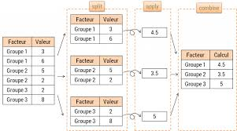

# Parallélisation

<script src="./hideOutput.js"></script>

```{r setup, include=FALSE}
knitr::opts_chunk$set(echo = TRUE)
knitr::opts_chunk$set(message = TRUE)
knitr::opts_chunk$set(warning = TRUE)

```


> The whole “let’s parallelize” thing is a huge waste of everybody’s time. There’s this huge body of “knowledge” that parallel is somehow more efficient, and that whole huge body is pure and utter garbage.
> 
> Big caches are efficient. Parallel stupid small cores without caches are horrible unless you have a very specific load that is hugely regular (ie graphics). [...]
>
> Give it up. The whole “parallel computing is the future” is a bunch of crock.
>
> Linus Torvalds


<!--------
Il faut pourtant conster que l'utilisation de codes compilés n'est plus suffisante pour obtenir des performances maximales. [...] Les fabricants ont cessé de chercher à créer des processeurs plus rapides, il y a environ 10 ans, lorsqu'ils ont plutôt choisi d'augmenter le nombre de coeurs computationnels à l'intérieur des processeurs. L'exploitation de ces coeurs multiples exige pour le programmeur l'adoption de techniques de programmation parallèle."
Vincent Miele et Violaine Louvet, Calcul parallèle dans R


Règle: ne jamais optimizer prématurément

https://books.google.fr/books?id=xaWyDgAAQBAJ&pg=PR9&lpg=PR9&dq=parallel+Rcpp+group+by&source=bl&ots=4CmQXgYd8v&sig=ACfU3U28I6J4EcQ4tx_SJi9QEjUnc7gMSw&hl=fr&sa=X&ved=2ahUKEwj5qcak2sjjAhUSJhoKHaxEDXUQ6AEwCHoECAkQAQ#v=onepage&q=parallel%20Rcpp%20group%20by&f=false
-------------->

<!----
CommOM: Remarques générales:
- Je parlerais systématiquement de "parallélisation" et jamais de "parallélisme";
- Attention à proposer une traduction française de tous les termes techniques anglais;
- Je ne suis pas très au clair sur la distinction coeur/processeur. Je te laisse juge de la pertinence des termes.
----->

## Principe

<!----
CommOM: Je ferais un paragraphe "Principe" beaucoup plus court, avec un exemple qui arriverait très vite, pour bien fixer les idées. Je mettrais toutes les remarques sur forces et faiblesses de la parallélisation juste après (dans le paragraphe suivant). Je pense qu'il faut bien expliquer qu'on fait tourner plusieurs processeurs au lieu d'un seul (car ce n'est sûrement pas clair pour tout le monde), et qu'il y a des processeurs maîtres des processeurs esclaves. Je comprends que les stratégies split-apply-combine et divide and conquer désignent la même chose (est-ce bien cela?). Tu pourrais également développer le parallèle (héhé) entre parallélisation et utilisation des fonction *apply (pour bien expliquer qu'on transforme un gros problème en une liste de petits problèmes, qu'on distribue ensuite à différents processeurs). Je pense que ça aiderait. Je propose une restructuration en ce sens.
----->

On parle de calcul parallèle lorsque des calculs sont effectués de manière simultanée sur plusieurs processeurs ou coeurs (un processeur ayant plusieurs coeurs) travaillant *en parallèle*, par opposition à une exécution séquentielle des calculs sur un seul processeur. Dans l'exemple ci-dessous, on peut faire une somme par groupe en traitant séparément les groupes: chaque processeur fait la somme pour un groupe, indépendamment des autres, puis on rassemble les résultats pour tous les groupes pour obtenir le résultat final.



La stratégie généralement adoptée, illustrée ci-dessus, est celle du `split`-`apply`-`combine` également appelée `divide and conquer`. On commence par découper (*split*) les données en blocs homogènes, indépendants. Sur ces blocs, on exécute (*apply*) des fonctions. Enfin, on regroupe les résultats (*combine*). On parle parfois de modèle `master`- `slave` ou `master`- `worker`: le processeur-maître (`master`) se charge des étapes *split* et *combine*, laissant l'étape *apply* aux processeurs-esclaves (`slaves`). 

Dans le scénario le plus simple, comme ci-dessus, la combinaison des données revient à une simple concaténation. Comme nous le verrons avec `spark`, l'étape finale peut être plus complexe. Des language très performants, tels que `spark`, reposent sur ce principe de la parallélisation en traitant les données par bloc tout en assurant une communication efficace entre ces blocs (le paradigme `map-reduce` est une application du principe `split`-`apply`-`combine` aux données volumineuses, @wickham2011split). 

La parallélisation

### A quelles conditions la parallélisation est-elle utile?

Comme l'exemple ci-dessus le suggère, **le calcul parallèle est particulièrement adapté dans des situations où on peut traiter des blocs de données indépendamment les uns des autres** (le traitement séquentiel de tels problèmes étant typique du problème *embarassingly parallel*). Les simulations numériques, le bootstrapping ou encore des statistiques descriptives par groupe sont autant de champs où l’utilisation du calcul parallèle s’avère utile. La parallélisation présente trois avantages principaux:

* Elle réduit le temps d'exécution de codes intensifs en calculs simples;
* Elle tire parti de l'ensemble des ressources disponibles en termes de CPU; 
* Elle est plus parcimonieuse en mémoire: en traitant des blocs moins volumineux, on réduit les besoins de mémoire (liés par exemple à des *copy* multiples).

La parallélisation présente aussi des désavantages, qu'il faut garder à l'esprit:

* Un processus `R` repose sur une session qui définit les objets, environnements et ressources disponibles pour les calculs. La parallélisation nécessite de créer des sessions supplémentaires pour les processus esclaves. Cette duplication est soit une duplication à l'identique de la session existante, ce qui a un coût en termes de performance ou de mémoire, ou une duplication d'une partie seulement des objets de la session maître, ce qui est un risque d'erreur accru. 
* Le *debuggage* est plus complexe car la remontée d'information entre le processeur et le logiciel, en l'occurence l'origine de l'erreur, est plus complexe dans un système parallélisé


Un point essentiel est que **paralléliser un traitement sur des données ne doit pas être le premier réflexe**. En effet, la parallélisation n'est pas une méthode d'optimisation d'un traitement statistique, mais simplement une technique qui permet d'accélérer l'exécution d'un traitement en mobilisant davantage de ressources. C'est pourquoi, avant de se tourner vers la parallélisation, il convient de s'assurer que les trois conditions suivantes sont vérifiées:

* **le code est efficace sur un seul coeur**;
* **le problème est adapté à la parallélisation**. La parallélisation ne prend sens que dans un cadre où on peut restructurer les données en blocs indépendants. Une somme cumulative sur un vecteur ne sera pas adaptée à la parallélisation (elle peut même ralentir le système). 
* **le *hardware* est adapté à la parallélisation**. Comme mettre en place une structure de parallélisation a un coup en termes de temps, il faut que le gain de temps associé à la parallélisation des calculs soit suffisant. De manière générale, il ne faut pas espérer une division du temps de calcul par $n$ dans un ordinateur avec $n$ coeurs. A partir de 4 coeurs, on peut tout de même espérer des gains de temps significatifs. 

Dans ce chapitre, nous montrerons les gains permis par la parallélisation en conjonction du `tidyverse`. Comme nous le montrerons dans le chapitre suivant, l'adoption de `data.table` offre une alternative intéressante et souvent préférable à une parallélisation aveugle. 

### Calcul parallèle vs multithreading

<!---
CommOM: Je comprends que cette section a pour objectif de donner des éléments techniques permettant de bien comprendre ce qu'est la parallélisation et de prendre du recul. Je pense que cette section est très utile mais trop rapide et trop technique (en l'état je ne comprends pas grand-chose). Je pense qu'il faudrait allonger cette section avec beaucoup plus de définitions (c'est quoi un processeur, une unité de traitement, le cache processor, ça veut dire quoi multicoeur…), et une approche pas-à-pas.
---->

Un processeur est dit *multithread* s'il est capable d'exécuter efficacement plusieurs *threads* (tâches élémentaires) simultanément. Contrairement aux systèmes multiprocesseurs (tels les systèmes multi-coeur), les *threads* doivent partager les ressources d'un unique coeur: les unités de traitement, le *cache processor* et le *translation look-aside buffer* ; certaines parties sont néanmoins dupliquées : chaque *thread* dispose de ses propres registres et de son propre pointeur d'instruction. Là où les systèmes multiprocesseurs incluent plusieurs unités de traitement complètes, le multithreading a pour but d'augmenter l'utilisation d'un seul coeur en tirant profit des propriétés des threads et de la parallélisation au niveau des instructions. 

<!-------
La librairie ne permet pas d’accélérer miraculeusement une procédure existante. En revanche, elle nous donne l’opportunité d’exploiter efficacement les ressources machines à condition de reprogrammer la procédure en réorganisant judicieusement les calculs. L’idée maîtresse est de pouvoir décomposer le processus en tâches que l’on peut exécuter en parallèle, charge à nous par la suite d’effectuer la consolidation.


Multithreaded processors also exploit the concurrency of multiple tasks, but in a different way and for a different reason. Instead of a system-level technique to spread CPU load, multithreading is processor-level optimization to improve area and energy efficiency. Multithreaded architecture is driven to a large degree by the realization that single-threaded, high-performance processors spend a surprising amount of time doing nothing. When the results of a memory access are required for a program to advance, and that access must reference RAM whose cycle time is tens of times slower than that of the processor, a single-threaded processor can do nothing but stall until the data is returned.

Multithreading can be described thus: If latencies prevent a single task from keeping a processor pipeline busy, a single pipeline should be able to complete more than one concurrent task in less time than it would take to run the tasks serially. This means running more than one task's instruction stream, or thread, at a time, which in turn means that the processor has to have more than one program counter and more than one set of programmable registers. Replicating those resources is far less costly than replicating an entire processor. 

A thread of execution is the smallest sequence of programmed instructions that can be managed independently by an operating system scheduler
On thing on threads the operating system performs a task known as "scheduling" in which it tries to find the optimal method of distributing workloads across available resources. 

Multithreading and Multicore are different pieces of terminology that apply to different areas of computing.
---------->

### *Fork* versus *socket*

<!-----
CommOM: Je ne mettrais pas l'extrait de doc en anglais (trop technique). Je mettrais un petit exemple pour expliquer pourquoi une approche est plus efficace que l'autre (montrer ce qu'un environnement commun entre maître et esclave apporte, et pourquoi c'est moins bien en Windows). Je ne suis pas sûr de bien comprendre ce que l'existence d'un environnement commun entre maître et esclave apporte: le processus esclave voit les mêmes macrovariables que le processus maître? Les mêmes données, donc ça évite de copier vers l'esclave?


> Fork is a concept from POSIX operating systems, and should be available on all R platforms except Windows. This creates a new R process by taking a complete copy of the master process, including the workspace and state of the random-number stream.
>
> However, the copy will (in any reasonable OS) share memory pages with the master until modified so forking is very fast.
>
> Vignette du package `parallel`
----->

Les systèmes `Unix` (Mac et Linux) et Windows ne gèrent pas la parallélisation de la même manière. Il y a en fait deux manières de gérer des opérations parallèles (plus de détail [ici](https://www.r-bloggers.com/parallel-r-socket-or-fork/) et dans la vignette du package `parallel`):

* **fork**: chaque processus parallèle est une duplication complète du maître et partage un environnement commun avec celui-ci, ce qui évite les copies d'objets réduisant la performance. Autrement dit, les processus esclaves parviennent à accéder à des éléments du processus maître sans les copier. Cette approche fonctionne uniquement dans les systèmes Unix, pas Windows.  
* **socket**: chaque processus fonctionne indépendamment, sans partage de variables ou objets communs sauf indication explicite (induisant une copie sur tous les *slaves*). Cela induit une perte de performance liée à la surcouche de communication. Néanmoins, c'est la seule approche possible sur Windows. 

Le comparatif ci-dessous compare la vitesse des deux approches sur un système `Unix`. Nous expliquerons dans la suite chaque étape du code ci-dessous, même si nous privilégierons `foreach::foreach` à `parallel::parLapply`.

**TO DO sur une machine Linux -----> **

<!--- <div class="fold s">   --->
```{r FORKSOCK, eval = FALSE}
df <- split(iris, iris$Species)


ncores <- parallel::detectCores() - 1

print(paste0("Nombre de processus esclaves pouvant être initialisés: ", ncores))

parallel_group_by <- function(df,
                              ncores = ncores,
                              type = c("PSOCK", "FORK")){
  type <- match.arg(type)
  ncores <- parallel::detectCores() - 1
  cl <- parallel::makeCluster(ncores, type = type)  
  sp <- parallel::parLapply(cl, df, function(k) mean(k$Petal.Width, na.rm=TRUE))
  parallel::stopCluster(cl)
  return(sp)
}

system.time(
  parallel_group_by(df, type = "FORK")
)
system.time(
  parallel_group_by(df, type = "PSOCK")
)
```
<!--- </div> -->


## Parallélisation en `R` avec le package `foreach`

### Quel(s) package(s) utiliser ?

Il existe plusieurs packages dédiés à la parallélisation des calculs en `R`:

* `parallel`: pré-installé sur `R` depuis la version 2.14. Il s'agit de la fondation pour des packages ultérieurs. Cependant, la fonction `parallel::mclapply` fonctionne sur les systèmes `Unix` (Mac et Linux) mais ne parallélise pas les calculs sur `Windows`. Sur `Windows`, on privilégiera `parallel::parLapply` qui fonctionne quelque soit l'OS et offre une syntaxe très proche de la fonction `lapply`.
* `snow`: implémentation des fonctions `*apply` dans un cadre parallèle. La fonction `snow::parLapply` permet, par exemple, d'effectuer des traitements sur chaque éléments d'une liste de manière indépendante. 
* `foreach`: offre une plus grande flexibilité. C'est le package que nous utiliserons. Le package doit être utilisé en conjonction avec un package comme `doParallel` pour mettre en place les *clusters* (représentation symbolique des processeurs fonctionnant en parallèle) et les associer aux données devant être traitées^[`doParallel` est approprié pour gérer la parallélisation sur un ordinateur individuel car il repose sur le package `multicore`. Il gère la différence entre un système windows et Unix. En revanche, `doParallel` n'est pas adapté pour une parallélisation sur un cluster d'ordinateurs].

### Vue d'ensemble d'un code parallélisé

Un code parallélisé en `R` peut être structuré de plusieurs façons. Voici une organisation possible en quatre grandes étapes:

1. **Le découpage des données à traiter**: On découpe les données en blocs indépendants en fonction d'une variable de groupe;
2. **L'initialisation de la parallélisation**: on initialise les processus esclaves et crée une barre de progrès, notamment le choix du nombre de clusters; sans initialisation des *clusters*, un code prévu pour être exécuté en parallèle ne produira pas la parallélisation attendue mais exécutera les tâches séquentiellement;
3. **L'exécution parallèle d'une série d'instructions**: on traite chaque bloc de données séparément;
4. **La finalisation du traitement parallèle**: un traitement en parallèle se termine par la fermeture des *clusters*.

Deux remarques sur l'initialisation et la finalisation du traitement:

* La parallélisation nécessite d'être attentif à l'initialisation des processus esclaves. Même si, en théorie, on peut fixer autant de processus que désiré, indépendamment du *hardware*, il est préférable, en pratique, de fixer le nombre de processus au nombre de coeurs disponibles^[Un ordinateur peut avoir plus de coeurs disponibles (coeurs logiques) que de coeurs physiques. On utilisera le nombre de coeurs logiques moins un. Pour utiliser le nombre de coeurs physiques d'une machine, on peut faire `parallel::detectCores(logical = FALSE)` au lieu de `parallel::detectCores()`] moins un. Le fait de créer $N-1$ processus esclaves permet de garder un coeur au *master*. 
* La fermeture des clusters est importante pour éviter de saturer la mémoire et la CPU avec des processus inactifs^[Sur Linux, avec la commande `htop`, on peut voir l'ensemble des processus actifs sur un serveur. On peut facilement identifier ceux liés à des processus esclaves: ceux-ci saturent le serveur, donc affectent l'ensemble des utilisateurs. Il est ainsi important, en local comme sur un serveur, de fermer les clusters.].

Voici un exemple de code parallélisé aveec `foreach` qui suit cette organisation (on complètera la partie 3 par la suite):

```{r structure foreach, eval = FALSE}

# ETAPE 1: ON DECOUPE LES DONNEES EN GROUPES HOMOGENES
# --------------------------------

df <- data.frame(
  x = rnorm(10e5),
  y = sample(1:10, size = 10e5, replace = TRUE)
)

df <- split(df,df$y)


# ETAPE 2: INITIALISATION DES CLUSTERS  
# ----------------------------------

cl <- parallel::makeCluster(parallel::detectCores()-1,
                            outfile = "")
doSNOW::registerDoSNOW(cl)

# ON CREE LA BARRE DE PROGRES
pb <- txtProgressBar(max = length(df), style = 3)
progress <- function(n) setTxtProgressBar(pb, n)
opts <- list(progress = progress)

# ETAPE 3: PARTIE PARALLELISATION
# -----------------------------------
#
# DO SOMETHING VERY SMART

# ETAPE 4: ON FERME LES CLUSTERS
# -----------------------------------

parallel::stopCluster(cl)
```

<!-------
In the following example, we start with detectCores function to determine the number of computing cores in the machine.It is noteworthy that detectCores() returns the number of Hyper-Threading rather than real physical cores.For example, there are two physical cores on my laptop, and each core can simulate two hyperthreading , so detectCores() return value is 4. However, for many compute-intensive tasks, the Hyper-Threading is not much helpful for improving performance, so we use the parameter of logical=FALSE to get the actual number of physical cores and then create the same number group.Since the worker processes in the group is new R sessions, the data and functions of the parent process is not visible. Therefore, we have to broadcast the data and functions to all worker processes by clusterExport function. Finally parLapply will distribute the tasks to all R worker processes evenly, and then gather results back.

------->

### Un programme parallélisé simple

Nous allons maintenant nous pencher en détail sur l'étape de traitement parallèle proprement dit (l'étape 3 présentée dans la section précédente). Pour illustrer cette étape, on va utiliser le *dataframe* ci-dessous, décomposé sous forme de liste, puis on initialise les *clusters*:

```{r dataframe split}
# ETAPE 0: CREER UN DATAFRAME
df <- data.frame(
  x = rnorm(10e6),
  y = sample(1:100, size = 10e6, replace = TRUE)
)

# ETAPE 1: ON DECOUPE LES DONNEES EN GROUPES HOMOGENES
# --------------------------------
df_list <- split(df,factor(df$y))

head(df)

# ETAPE 2: INITIALISATION DES CLUSTERS  
# ----------------------------------

cl <- parallel::makeCluster(parallel::detectCores()-1,
                            outfile = "")
doSNOW::registerDoSNOW(cl)

# ON CREE LA BARRE DE PROGRES
pb <- txtProgressBar(max = length(df), style = 3)
progress <- function(n) setTxtProgressBar(pb, n)
opts <- list(progress = progress)
```
<!----
library(doParallel)
> cl <- makeCluster(2)
> registerDoParallel(cl)
------>

Pour se simplifier la vie, on va importer le package `foreach`^[L'ensemble des programmes de ce `markdown` pourraient être exécutés sans importer le package `foreach` dans son ensemble mais uniquement les fonctions `%dopar%` et `%do%`, par exemple avec le package `import`: `import::from("data.table","%dopar%")` et `import::from("data.table","%do%")` ]:

```{r charge foreach}
library(foreach)
```

Le package `foreach` propose deux fonctions utiles pour le traitement d'opérations:

* `%do%`: propose une alternative à `lapply` pour un traitement séquentialisé des opérations, c'est-à-dire une tâche après l'autre;
* `%dopar%`: propose une alternative à `lapply` pour un traitement parallélisé des opérations.

Sans définition préalable des *clusters*, la fonction `%dopar%` exécute les tâches séquentiellement: on ne peut pas espérer de gain de temps par rapport à une solution non parallélisée. `%dopar%` renvoie d'ailleurs un *warning* dans ce type de situation. Le petit benchmark suivant montre, encore une fois, qu'une solution vectorisée reste préférable à une exécution séquentialisée sous-optimale. 

```{r foreach no parallel, warning=TRUE}
microbenchmark::microbenchmark(
  foreach(i=1:100) %do% sqrt(i),
  foreach(i=1:100) %dopar% sqrt(i),
  sqrt(1:100)
)
```

Le traitement parallèle est réalisé par la fonction `foreach()` associée à la fonction `%dopar%`.
On fournit les options suivantes à la fonction `foreach()`:

* `g`: les données découpées par groupe sur lesquelles on effectue le traitement. Vous pouvez les appeler autrement, c'est un argument dont le nom peut être choisi librement tant qu'il est cohérent avec celui qui figure dans la partie `%dopar%`;
* `.combine`: la manière dont les données sont assemblées à l'issue des tâches. A titre personnel, j'utilise souvent `.combine = "list"` pour la flexibilité permise par `R` dans le maniement des listes. D'autres combinaisons sont possibles (`c`,`cbind`,`rbind`,`+`, etc. ), comme nous le verrons avec l'exercice consacré au bootstrap;
* `.multicombine = TRUE` et `.maxcombine = TRUE`: permet de sortir une liste, éventuellement à plusieurs niveaux, dont le nombre d'éléments de premier niveau est égal au nombre de groupes. Dans le *template* proposé ci-dessous, on propose une méthode qui évite d'avoir une liste imbriquée comme le généreraient les options par défaut ;
* `.options.snow`: les options supplémentaires à passer au package `foreach`. Ici, ce sont les barres de progrès;
* la boucle `%dopar%` qui contient le traitement que l'on veut appliquer à chaque groupe. Dans notre exemple, il s'agit tout simplement de calculer la moyenne de $x$ pour chaque groupe défini par la valeur de $y$. On va ainsi retourner `data.frame(x = mean(g$x), y = unique(g$y))` dans la boucle `%dopar%`.

Voici le code de la troisième étape.

```{r, eval = FALSE}
# ETAPE 3: PARTIE PARALLELISATION
# -----------------------------------
  output <- foreach::foreach(g = df_list, 
                             .combine = "list",
                             .multicombine = TRUE,
                             .maxcombine = length(df_list),
                             .options.snow=opts
  ) %dopar% {
    data.frame(x = mean(g$x), y = unique(g$y))
  }

```

Ce code réplique précisément le comportement `split`-`apply`-`combine` des approches `tidyverse` ou `data.table`, et peut se lire comme ceci: pour chaque élément `g` de `df_list` (étape `split`), on construit en parallèle un `data.frame` qui contient la moyenne de $x$ et la valeur de $y$ (étape `apply`), et enfin on combine les résultats sous forme d'une liste (étape `combine`).

Enfin, on n'oublie pas de fermer les *clusters*.

```{r, eval = FALSE}
# ETAPE 4: ON FERME LES CLUSTERS
# -----------------------------------

parallel::stopCluster(cl)
```

En supposant que l'*output* de `foreach` est nommé `output`, on peut utiliser la fonction `do.call` avec l'argument `what = rbind` et `args = output` pour regrouper les données^[ou alors utiliser l'argument `.combine = "rbind"` plutôt que `.combine = "list"`];

**Exercice** Profiler l'ensemble grâce à la fonction `profvis::profvis`;

<div class="fold s">
```{r, eval = FALSE}
profvis::profvis({
  # CLUSTER INITIALIZATION  
  # cl <- parallel::makeCluster(parallel::detectCores()-1,
  #                             outfile = "")
  cl <- parallel::makeCluster(16,
                              outfile = "")
  doSNOW::registerDoSNOW(cl)
  
  pb <- txtProgressBar(max = length(df_list), style = 3)
  progress <- function(n) setTxtProgressBar(pb, n)
  opts <- list(progress = progress)
  
  output <- foreach::foreach(g = df_list, .combine = "list",
                             .multicombine = TRUE,
                             .maxcombine = length(df_list),
                             .options.snow=opts
  ) %dopar% {
    data.frame(x = mean(g$x), y = unique(g$y))
  }
  
  # CLOSE CLUSTERS  
  parallel::stopCluster(cl)
  
  output <- do.call(rbind, output)
})
```
</div>

De nombreuses options supplémentaires sont disponibles, rendant le contrôle de la configuration aisé. La ligne finale `do.call(rbind, output)` consiste seulement à restructurer les données sous forme de *dataframe*: c'est un enchaînement classique et très pratique d'avoir des résultats stockés sous forme de liste et appliquer la fonction `do.call`

Le code équivalent, avec `dplyr` est beaucoup moins bavard:

```{r}
profvis::profvis({
  import::from("magrittr","%>%")
  output <- df %>% dplyr::group_by(y) %>%
    dplyr::summarise(x = mean(x))
})
```

Ce *profiling* montre qu'ici l'approche parallélisée est moins rapide (le coût fixe payé par l'initialisation des clusters n'est pas compensé par un temps d'exécution plus rapide que `dplyr`). Néanmoins, en termes de mémoire, la parallélisation est beaucoup plus parcimonieuse. Le fait de traiter des données en blocs moins volumineux permet d'utiliser 20 fois moins de mémoire qu'avec `dplyr`. 

### Un programme parallélisé plus complexe

CommOM: je trouve que cet exemple est hyper bien. Toutefois, je ferais les choses en deux temps: 1/ On code d'abord les régressions en tidyverse, puis en foreach (sans `profvis`); 2/ on compare les performances avec `profvis`. Sinon c'est un peu déroutant. Si tu es d'accord je peux réorganiser la section en ce sens.

Voyons voir l'intérêt de la parallélisation sur une tâche plus complexe: une régression linéaire par groupe. Prenons un *dataframe* plus petit:

```{r}
df <- data.frame(
  x = rnorm(10e6),
  z = sample(1:50, size = 10e6, replace = TRUE)
)

df$y <- df$x + rnorm(10e6)

df_list <- split(df,df$z)
```

Les deux méthodes en compétition sont les suivantes:

1. Une approche `tidyverse` invoquant la fonction `dplyr::do` puis ` tidyr::unnest`;
2. Une approche parallélisée.

Le but est de ressortir les coefficients, pas l'ensemble des résultats fournis par la fonction `lm`.

**Exercice** : Vous pouvez essayer de coder l'approche `tidyverse` si vous êtes à l'aise avec la syntaxe:

* Grouper les données avec la fonction `z`;
* Utiliser `dplyr::do` et `coef` pour retourner les coefficients d'une régression linéaire par groupe;
* Utiliser `tidyr::unnest` pour retourner les données sous forme de `data.frame`.
* Une fois que vous êtes parvenus à coder cet enchaînement, mesurer la vitesse et les besoins mémoire avec `profvis`

<div class="fold s">
```{r}
profvis::profvis({
  import::from("magrittr","%>%")
  output <- df %>% dplyr::group_by(z) %>%
    dplyr::do(ols = coef(lm(y ~x, data = .))) %>%
    tidyr::unnest()
})
```
</div>

Maintenant, passons à la version parallélisée. Cette fois, pour retourner les résultats dans le coeur du `%dopar%`, vous pouvez écrire `return(c(unique(g$z), coef(lm(y ~x, data = g))))`.

**Exercice**: Essayez d'écrire le programme parallélisé équivalent:

<div class="fold s">
```{r, eval = FALSE}
profvis::profvis({
  # CLUSTER INITIALIZATION  
  # cl <- parallel::makeCluster(parallel::detectCores()-1,
  #                             outfile = "")
  cl <- parallel::makeCluster(16L,
                              outfile = "")
  doSNOW::registerDoSNOW(cl)
  
  pb <- txtProgressBar(max = length(df_list), style = 3)
  progress <- function(n) setTxtProgressBar(pb, n)
  opts <- list(progress = progress)
  
  output <- foreach::foreach(g = df_list, .combine = "list",
                             .multicombine = TRUE,
                             .maxcombine = length(df_list),
                             .options.snow=opts
  ) %dopar% {
    return(c(unique(g$z), coef(lm(y ~x, data = g))))
  }
  
  # CLOSE CLUSTERS  
  parallel::stopCluster(cl)
  
  output <- do.call(rbind, output)
})
```
</div>

```{r}
profvis::profvis({
  # CLUSTER INITIALIZATION  
  # cl <- parallel::makeCluster(parallel::detectCores()-1,
  #                             outfile = "")
  cl <- parallel::makeCluster(16L,
                              outfile = "")
  doSNOW::registerDoSNOW(cl)
  
  output <- foreach::foreach(g = df_list, .combine = "list",
                             .multicombine = TRUE,
                             .maxcombine = length(df_list) ) %dopar% {
    return(c(unique(g$z), coef(lm(y ~x, data = g))))
  }
  
  # CLOSE CLUSTERS  
  parallel::stopCluster(cl)
  
  output <- do.call(rbind, output)
})
```

Cette fois, la solution parallélisée est légèrement plus rapide et demande surtout 2000 fois moins de mémoire (depuis une console `R`). Cela illustre bien la manière dont l'approche *divide and conquer* peut aider en cas de traitements gourmands à limiter l'inflation des besoins en RAM.

### Export de dépendances et de variables

<!----
CommOM: très bon exemple, bien pédagogue. Je propose simplement de séparer la partie solution et la partie évaluation des performances. Je mets `eval = FALSE` sur les chunks de solutions, à toi de voir si c'est pertinent.
----->

Les processus esclaves que l'on a, jusqu'à présent, initialisés, sont très parcimonieux: il s'agit d'une simple réplication d'une session R base, sans dépendance externe (packages) et sans variables autres que la liste de données fournie en input. A l'appel précédent, on peut ajouter les arguments suivants:

* `.packages`: liste de packages qu'il est nécessaire de fournir aux processus esclaves;
* `.export`: objets de l'environnement de la session maître qui doivent être mis à disposition des sessions esclaves.

Soit, par exemple, la fonction suivante, qui ajoute une étape nécessitant `dplyr`, à l'approche précédente:

```{r}
#' Create a new random variable and perform linear regression
#' 
#' @param df Dataframe
#' @return Coefficients from \code{lm} function

do_stuff <- function(df){
  df2 <- df %>% dplyr::mutate(x2 = x + runif(nrow(df)))
  return(df2)
}

```

**Exercice**:

On reprend l'exercice précédent mais remplace la formule par `Y ~ x+x2` après avoir créé `x2`.

1. Ecrire la version séquentielle avec le `tidyverse`;
2. Ecrire la version parallélisée. Pour gagner du temps de calcul avec la version parallélisée, vous pouvez retirer la barre de progrès. N'oubliez pas les arguments `.export` (pour `do_stuff`) et `.packages` (pour `dplyr`);
3. Faire un profiling des deux solutions avec `profvis`.

La solution pour la version séquentielle avec le `tidyverse` ci-dessous:

<div class="fold s">
```{r, eval = FALSE}
import::from("magrittr","%>%")
output <- df %>%
  dplyr::mutate(x2 = x + runif(nrow(df))) %>%
  dplyr::group_by(z) %>%
  dplyr::do(ols = coef(lm(y ~x + x2, data = .))) %>%
  tidyr::unnest()
```
</div>

La solution pour la version parallélisée:

```{r, warning=FALSE, eval = FALSE}
# CLUSTER INITIALIZATION  
# cl <- parallel::makeCluster(parallel::detectCores()-1,
#                             outfile = "")
cl <- parallel::makeCluster(16L,
                            outfile = "")
doSNOW::registerDoSNOW(cl)

output <- foreach::foreach(g = df_list, .combine = "list",
                           .multicombine = TRUE,
                           .maxcombine = length(df_list),
                           .export = c("do_stuff"),
                           .packages = c("dplyr")
) %dopar% {
  g2 <- do_stuff(g)
  return(c(unique(g2$z), coef(lm(y ~x + x2, data = g2))))
}

# CLOSE CLUSTERS  
parallel::stopCluster(cl)

output <- do.call(rbind, output)
```

On peut maintenant comparer les performances des deux solutions avec `profvis`. D'abord la solution séquentielle en `tidyverse`.

```{r}
profvis::profvis({
  import::from("magrittr","%>%")
  output <- df %>%
    dplyr::mutate(x2 = x + runif(nrow(df))) %>%
    dplyr::group_by(z) %>%
    dplyr::do(ols = coef(lm(y ~x + x2, data = .))) %>%
    tidyr::unnest()
})
```

Puis la solution parallélisée:

```{r, warning=FALSE}
profvis::profvis({
  # CLUSTER INITIALIZATION  
  # cl <- parallel::makeCluster(parallel::detectCores()-1,
  #                             outfile = "")
  cl <- parallel::makeCluster(16L,
                              outfile = "")
  doSNOW::registerDoSNOW(cl)
  
  output <- foreach::foreach(g = df_list, .combine = "list",
                             .multicombine = TRUE,
                             .maxcombine = length(df_list),
                             .export = c("do_stuff"),
                             .packages = c("dplyr")
  ) %dopar% {
    g2 <- do_stuff(g)
    return(c(unique(g2$z), coef(lm(y ~x + x2, data = g2))))
  }
  
  # CLOSE CLUSTERS  
  parallel::stopCluster(cl)
  
  output <- do.call(rbind, output)
})
```

La solution parallélisée est légèrement plus lente (moins de temps de calcul mais un coût fixe lié à l'initialisation des clusters). En revanche, elle est encore une fois beaucoup moins gourmande en mémoire.

## Application: bootstrap


### Cadre

L'objectif de cette partie est d'étendre les régressions par groupe dans un cadre de bootstrap. Cela prendra la forme suivante, en supposant qu'on dispose de *N* observations :

1. On tire aléatoirement, avec remise, *N* observations;
2. On effectue une régression linéaire pour ressortir la valeur des coefficients sur cet échantillon aléatoire;
3. On réplique *K* fois les étapes 1 et 2. On obtient alors une suite de coefficients $(\beta_k)_{\{k _in [1,K]\}}$.

Ici, on va prendre $K=100$. Nous ajoutons à ce cas d'école le fait que les régressions linéaires sont effectuées par groupe. 

Ce problème peut être parallélisé de deux façons:

* par groupe: les groupes étant indépendants, on pourrait effectuer séquentiellement les $K$ itérations du bootstrap;
* par itération: on effectue de manière parallèle les itérations et chaque coefficient de groupe est traité séquentiellement ou simultanément.

On privilégie la parallélisation par itération avec, pour chaque groupe, un coefficient. C'est une approche beaucoup plus appropriée pour la parallélisation.

Pour que chaque itération soit plus rapide, nous réduisons la taille des données à 1000 lignes et le nombre de groupes à 5.

```{r}
df <- data.frame(
  x = rnorm(10e4),
  z = factor(sample(1:5, size = 10e4, replace = TRUE))
)
df$y <- df$x + rnorm(10e4)
head(df)
```

### Approche séquentielle

**Exercice: **

1. Créez une fonction `bootstrap_sequential` qui retourne le coefficient d'une régression linéaire. La formule prend la forme `y ~ x:z` qui permet de retourner les coefficients propres à chaque groupe en un seul appel de fonction;
2. Appeler la fonction `bootstrap_sequential` 100 fois avec `lapply`;
3. Profiler cette solution avec `profvis`.

Voici la solution séquentielle (questions 1 et 2):
<div class="fold s">
```{r, eval = FALSE}
bootstrap_sequential <- function(df){
  data <- df[sample(1:nrow(df), size = nrow(df), replace = TRUE),]  
  reg_group <- coef(lm("y ~ x:z", data = data))
  return(reg_group)
}

approche_sequentielle <- lapply(1:100, function(k) bootstrap_sequential(df))
approche_sequentielle <- do.call(rbind, approche_sequentielle)
```
</div>

Voici l'évaluation de la performance de cette solution avec `profvis` (question 3):

```{r}
bootstrap_sequential <- function(df){
  data <- df[sample(1:nrow(df), size = nrow(df), replace = TRUE),]  
  reg_group <- coef(lm("y ~ x:z", data = data))
  return(reg_group)
}

profvis::profvis({
  approche_sequentielle <- lapply(1:100, function(k) bootstrap_sequential(df))
  approche_sequentielle <- do.call(rbind, approche_sequentielle)
})

head(approche_sequentielle)
```

Comme on peut le voir sur le graphique interactif, une approche séquentielle est:

* Très gourmande en mémoire;
* Très inefficiente: on reproduit fréquemment la même opération.


### Approche parallélisée

**Exercice**:

1. Appelez de manière parallèle `bootstrap_sequential` (vous pouvez utiliser `.combine = "rbind"` pour vous épargner l'appel à `do.call`);
2. Profilez cette solution avec `profvis`.

Voici la solution parallélisée (question 1):

<div class="fold s">
```{r, warning=FALSE, eval = FALSE}
bootstrap_sequential <- function(df){
  data <- df[sample(1:nrow(df), size = nrow(df), replace = TRUE),]  
  reg_group <- coef(lm("y ~ x:z", data = data))
  return(reg_group)
}

# CLUSTER INITIALIZATION  
# cl <- parallel::makeCluster(parallel::detectCores()-1,
#                             outfile = "")
cl <- parallel::makeCluster(16L,
                            outfile = "")
doSNOW::registerDoSNOW(cl)

approche_parallel <- foreach::foreach(k = 1:100, .combine = "rbind",
                           .multicombine = TRUE,
                           .maxcombine = 100,
                           .export = c("bootstrap_sequential", "df")
) %dopar% {
  return(bootstrap_sequential(df))
}

# CLOSE CLUSTERS  
parallel::stopCluster(cl)
```
</div>

Voici l'évaluation de la performance de cette solution avec `profvis` (question 2):

```{r, warning=FALSE}
bootstrap_sequential <- function(df){
  data <- df[sample(1:nrow(df), size = nrow(df), replace = TRUE),]  
  reg_group <- coef(lm("y ~ x:z", data = data))
  return(reg_group)
}

profvis::profvis({
# CLUSTER INITIALIZATION  
# cl <- parallel::makeCluster(parallel::detectCores()-1,
#                             outfile = "")
cl <- parallel::makeCluster(16L,
                            outfile = "")
doSNOW::registerDoSNOW(cl)

approche_parallel <- foreach::foreach(k = 1:100, .combine = "rbind",
                           .multicombine = TRUE,
                           .maxcombine = 100,
                           .export = c("bootstrap_sequential", "df")
) %dopar% {
  return(bootstrap_sequential(df))
}

# CLOSE CLUSTERS  
parallel::stopCluster(cl)
})

head(approche_parallel)
```

Le résultat est cette fois clairement en faveur de l'approche parallélisée:

* *Mémoire*: 2000 fois moins de mémoire;
* *CPU*: 50\% plus rapide.

<!-----------

Parallel computing is ideal for **Monte-Carlo simulations**. Each core independently simulates a realisation from the model. 

Many statistical and machine learning applications rely on pseudo-random numbers for things like
sampling from distributions and stochastic optimization. When child processes are spawned to compute in parallel, care needs to be taken to ensure random number streams behave as expected. This is particularly true for bootstrap inference, Monte Carlo simulations, and other applications where it is important that iterations are independent. Care is also needed to ensure results can be reliably reproduced using set.seed().

MCMC is by its very nature a serial algorithm — each iteration depends on the results of the last iteration. It is, therefore, rather difficult to parallelize MCMC code so that a single chain will run more quickly by splitting the work along multiple processors.

A more straightforward way to parallelize MCMC code is to run multiple chains on multiple processors. Since the chains are independent of each other, it is mainly an issue of bookkeeping to distribute the work among several processing units.
----------->

## Conclusion

Ouverture sur: facilité à faire du calcul parallèle en R (par rapport à d'autres langages) mais les limites (parfois mieux d'avoir un seul coeur bien utilisé)

