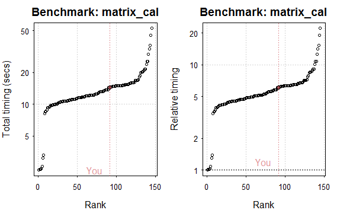

```{r setup, include=FALSE}
knitr::opts_chunk$set(echo = TRUE)
knitr::knit_engines$set(python = reticulate::eng_python)
```

```{r check reticulate}
library(reticulate)
reticulate::py_available(TRUE)

# if (Sys.getenv("LOCAL")==""){
#   python_path <- list.dirs("/usr/local/", full.names = FALSE)
#   python_path <- python_path[startsWith(python_path,"python")]
#   reticulate::use_python(paste0("/usr/local/", python_path, "/bin/python3"))
#   # knitr::opts_chunk$set(engine.path = list(python = 'C:/Users/W3CRK9/AppData/Local/Continuum/anaconda3/envs/r-reticulate'))
# }
```

```{r, eval=FALSE}
if (Sys.getenv("LOCAL")==""){
  Sys.setenv(RETICULATE_PYTHON = "/opt/conda/envs/Reticulate/bin")
  use_condaenv("Reticulate")
  # print(reticulate::py_config())
  # conda_create("r-reticulate")
# install SciPy
  # conda_install("r-reticulate", "scipy")

  reticulate::conda_install("Reticulate", "scipy")
}
```

>  Premature optimization is the root of all evil (or at least most of it) in programming.
>
> Donald Knuth

# Introduction

L'objectif du cours est d'offrir une introduction aux possibilités qu'offre `R` pour faire des calculs lourds et lire de grosses bases de données. Les deux principales ressources disponibles sur le sujet sont les ouvrages *Efficient R Programming* [@gillespie2016efficient] et *Advanced R* [@wickham2014advanced]^[Dans ce cours, on adoptera la vision de l'efficience au sens d'efficience algorithmique, i.e. la vitesseà laquelle un programme s'exécute et les ressources nécessaires pour l'accomplissement de celui-ci. Nous parlerons peu de la notion d'efficacité de programmation: quantité de travail utile qu'un programmeur peut réaliser par unité de temps. A cet égard, des astuces et règles utiles sont présentées dans la Formation *travail collaboratif sous R* et dans le livre de @gillespie2016efficient].

Avant de chercher à optimiser, le premier réflexe à adopter est de bien structurer le problème que l'on vise à résoudre et sélectionner le format de données et les *packages* les plus adéquats. `R` étant un langage très malléable, il existe généralement plusieurs manières de résoudre un problème: avoir un code efficace nécessite en premier lieu de choisir le meilleur outil disponible en `R`. Par exemple, si on doit passer par une boucle, il vaut mieux choisir rapidement de faire du `Rcpp` plutôt qu'écrire une boucle `R` qu'on accélèrera par la suite. Un des objectifs de ce cours est de faire connaître les outils les plus adéquats pour des problèmes génériques. Plutôt qu'essayer de paralléliser sur 16 coeurs, il est parfois préférable de bien en utiliser un seul. 

Quand on se préoccupe d'efficacité ou de gestion de mémoire, le principal risque est la dette technique: un code pas très bon pour lequel on reporte le moment de l'améliorer. Il s'agit, par exemple, d'un code qui utilise des boucles au lieu d'une opération vectorisée. Bien réfléchir à la structure du programme, à son découpage en parties homogènes, au format de données et aux packages mobilisables, est fondamental.

Alors que le volume de données disponibles et pouvant être combinées est croissant, le ralentissement des progrès technologiques dans l'industrie des microprocesseurs (ralentissement de la loi de Moore^[Selon cette loi, le nombre de transistors composant un micro-processeur double tous les 18 mois à coût constant. Cela implique une capacité de calcul croissant à une grande vitesse. Cette observation empirique a été globalement respectée jusqu'en 2016, date depuis laquelle les progrès ont marqué le pas.]) justifie l'utilisation croissante de capacités de calculs parallèles. L'exploitation des systèmes multi-coeurs, qui sont maintenant communs, permet de limiter l'effet limitant du ralentissement de la loi de Moore sur les capacités de traitement. 

# Plan du cours

La première étape nécessaire pour être en mesure d'être efficace en `R` et de comprendre le fonctionnement du langage. Comprendre la manière dont `R` fonctionne permet de comprendre l'intérêt de la vectorisation ainsi que la manière dont la mémoire fonctionne en `R`. Ce détour par le lange de base permettra de mieux comprendre les raisons pour lesquelles `R` est un langage plus lent qu'un langage compilé et limité lorsqu'il est question de données volumineuses.


# Outils utiles pour mesurer l'exécution de fonctions

Nous allons utiliser deux types d'approches pour minuter la vitesse d'exécution d'un programme:

* **Benchmarking**: test de performance basé sur la répétition d'opérations
* **Profiling**: exécution d'une série de commande afin de déterminer les goulets d'étranglement

La première approche est généralement suivie lorsqu'on veut optimiser une opération pour laquelle plusieurs méthodes existent. La seconde approche permet de cibler les étapes d'un programme à cibler pour accélérer les calculs ou réduire l'utilisation de la mémoire.

Sur Linux, la commande `htop` permet de voir, en temps réel, l'utilisation des différents coeurs d'un ordinateur. Sur Windows, le gestionnaire des tâches permet de contrôle la CPU et la RAM utilisés.


## Microbenchmark

La fonction `system.time()` est la manière la plus simple de mesurer le temps d'éxécution d'une ou plusieurs fonctions. Cependant, le temps d'exécution observé n'est qu'une réalisation d'une variable aléatoire et dépend de l'utilisation, à l'instant *t*, des ressources d'un ordinateur. Pour obtenir une image plus fidèle de la vitesse d'exécution d'une fonction, et être en mesure de comparer plus pleinement des temps d'exécution, le package `microbenchmark` est très pratique. Comme les fonctions évaluées sont répétées de nombreuses fois (par défaut 100), on utilise `microbenchmark` pour des opérations rapides (quitte à utiliser les fonctions évaluées sur un échantillon plus petit de données). 

Par exemple, si on désire évaluer la performance des moyennes par groupe avec `dplyr`, `data.table` et en base `R`

<!-----
Exercice: Utiliser le package microbenchmark pour faire une moyenne par groupe du dataframe suivant

1. Avec une solution `R` base:  àggregate`
2. Avec une solution `dplyr`: `group_by` puis `summarise`
3. Avec une solution `data.table`: `dt[,mean(),by = ]`
----->

```{r first microbenchmark example, message = FALSE}
# On importe seulement le pipe, pas tout dplyr
import::from("magrittr","%>%")

# On crée un dataframe avec 5 catégories
df <- data.frame(x = rnorm(10e5),
                 y = sample(1:5,size = 10e5,
                            replace = TRUE))
# On crée son alter-ego data.table pour éviter de faire la conversion N fois
dt <- data.table::data.table(df)
# On indexe le data.table pour tirer pleinement parti du package (cf. chapitre data.table)
data.table::setkeyv(dt,"y")


# Compare data.table, dplyr, base R
micro <- microbenchmark::microbenchmark(
  aggregate(df$x, by = list(df$y), FUN = mean),
  dt[,mean(x), by = y],
  df %>% dplyr::group_by(y) %>% dplyr::summarise(mean(x)),
  times = 20
)
print(micro)

ggplot2::autoplot(micro)
```

Cela nous permet de voir que l'approche `data.table` est plus rapide (l'ordre de grandeur est ici de l'ordre de 1 pour 4 par rapport à `dplyr` et 1 pour 40 par rapport à la solution R base.)

## Profiling

Le *profiling* consiste à contrôler le temps d'exécution et l'usage mémoire d'une série de commandes. C'est une approche particulièrement bien adaptée à des codes modulaires (découpés sous formes de *chunks*) puisqu'on peut vraiment contrôler les parties de code les plus gourmandes en temps ou en mémoire. 


```{r, eval = FALSE}
profvis::profvis(expr = {
  
  # Stage 1: load packages
  # library("rnoaa") # not necessary as data pre-saved
  library("magrittr")
  
  # Stage 2: load and process data
  df <- data.frame(x = rnorm(10e5),
                    y = sample(1:5,size = 10e5, replace = TRUE))
  
  df2 <- df %>% dplyr::group_by(y) %>%
    dplyr::summarise(x2 = mean(x)) %>%
    dplyr::mutate(x2 = x2/mean(x2))
  
  df <- df %>% dplyr::left_join(df2)

  # Imaginons on fait une moyenne par groupe avec lapply
  # (nb: pas du tout la methode la plus efficace)
  # lapply(unique(df$y))

  # Stage 3: visualise output
  p <- ggplot2::ggplot(df,
                  ggplot2::aes(x = factor(y), y = x)
                  ) +
    ggplot2::geom_boxplot(aes(colour = factor(y))) +
    ggplot2::theme_bw()
  
  print(p)
  
})


```

Avec cet exemple, on voit que la majorité du temps est passée dans la représentation graphique, étape la plus longue et la plus exigente en mémoire. 


## Exercice

```{r}
x = 1:100 # initiate vector to cumulatively sum

# Method 1: with a for loop (10 lines)
cs_for = function(x){
  for(i in x){
    if(i == 1){
      xc = x[i]
    } else {
      xc = c(xc, sum(x[1:i]))
    }
  }
  xc
}

# Method 2: with apply (3 lines)
cs_apply = function(x){
  sapply(x, function(x) sum(1:x))
}

# Method 3: cumsum (1 line, not shown)
print(
  microbenchmark::microbenchmark(cs_for(x), cs_apply(x), cumsum(x))
)

```

# Comprendre les ordinateurs pour comprendre `R`

Un ordinateur est une réalisation concrête d’une machine de Turing, c'est-à-dire une
machine traitant des informations et capable en principe de prendre comme donnée n’importe quel algorithme et de l’exécuter.

## Principes généraux

Les deux principaux constituants d’un ordinateur sont la mémoire principale et le processeur ou CPU (Central Processing Unit). La mémoire principale permet de stocker de l’information (programmes et données), tandis que le processeur exécute pas à pas les instructions composant les programmes.


L'interaction entre les différentes composantes d'un ordinateur suit l’architecture de Von-Neumann:

1. Le processeur (CPU pour Central Processing Unit) est conceptuellement décomposé en:
    + une unitée de contrôle (UC): séquence les opérations
    + une unitée de calcul arithmétique et logique (UAL): exécution des opérations de base
    + un registre
2. La mémoire: contient à la fois les données et le programme
exécuté par l’unité de contrôle
    + Mémoire vive ou volatile (RAM pour random access memory): contient programmes et données en cours de traitement
    + Mémoire permanente (ROM pour read only memory): stocke
programmes et données de base de la machine
3. Dispositifs d'entrée-sortie (input/output): périphériques qui permettent de communiquer avec le monde extérieur
4. Canaux de communication (les bus) entre la mémoire, le processeur et les périphériques


La carte mère est le support physique permettant la coordination de l’ensemble des éléments intervenant dans le fonctionnement d’un ordinateur.

Si l’architecture de Von-Neumann se caractérise par sa grande souplesse, elle présente en revanche trois gros inconvénients :

1. Une exécution séquentielle : L’architecture de Von Neumann impose une exécution séquentielle des instructions. Avec ce modèle, il n’est donc pas possible d’effectuer différents travaux en parallèle.
2. Un goulet d’étranglement : Alors que le microprocesseur peut exécuter des instructions très rapidement, celles-ci sont de toute façon ralenties par la vitesse de transfert des informations dans les bus de communication.
3. Faible robustesse : Le fait que les données et les programmes soient mélangés engendre une fragilité du modéle de Von-Neumann : si une donnée est enregistrée à l’emplacement d’un programme, le comportement de l’ordinateur peut devenir complètement incohérent.

Le système d'exploitation donne l'illusion que de nombreux processus peuvent être exécutés en même temps. Cela provient de la conjonction de deux effets : d’une part, les instructions exécutées par l’ordinateur sont extrêmement rapides (de l’ordre de quelques dizaines de millisecondes) et d’autre part, le système d’exploitation utilise les temps d’attente dans l’exécution d’une tâche pour orienter les ressources de l’ordinateur (micro-processeur + RAM...) vers l’exécution d’une autre tâche. Le fait que la plupart des ordinateurs soient maintenant dotés de plusieurs processeurs permet, si les applications sont adaptées, d’exécuter réellement plusieurs tâches simultanément. Malgré tout, le nombre d’instructions effectuées simultanément reste habituellement très inférieur au nombre d’applications en fonctionnement simultané.

### Langage interprété vs compilé

`R` est un langage interprété, par opposition aux langages compilés (`C++` par exemple). Par rapport à l’interpréteur, le compilateur présente l’inconvénient de retarder l’exécution d’un programme mais une fois compilé, le fichier exécutable obtenu est particulièrement rapide (moins de surcouche vers le langage machine).

Certains packages (par exemple `compiler`) proposent d'accélérer les traitements en transformant des exécutions interprétées (du code `R` standard) en instructions compilées (`bytecode`). C'est une méthode, assez simple puisque c'est le package qui gère cette traduction, pour accélérer certains programmes. 


## Le processeur (CPU)


Le processeur (ou micro-processeur) est considéré comme le coeur de l’ordinateur. C’est lui qui attribut des tâches simples aux périphériques et à la RAM tandis qu’il exécute les tâches les plus compliquées. Il est responsable de l’exécution d’un programme. Le processeur est un circuit éléctronique complexe (circuit intégré) qui exécute chaque instruction très rapidement, en quelques cycles d’horloges. Toute l’activité de l’ordinateur est cadencée par une horloge unique, de façon à ce que tous les circuits électroniques
travaillent tous ensemble de façon synchronisée. La fréquence de cette horloge s’exprime en MHz (millions de cyles par seconde) ou GHz (milliards de cycles par secondes). Par exemple, le processeur *Intel Core i5-6300U* qui équipe les postes nomades INSEE possède une horloge cadencée à 2,40 GHz.

Un processeur est défini, entre autres, par :

1. La largeur de ses registres internes de manipulation de données. Les registres sont des mémoires de petite taille (quelques octets), suffisamment rapides pour que l’UAL puisse manipuler leur contenu à chaque cycle de l’horloge. Les deux largeurs les plus communes sont 32 et 64 bits.
2. La cadence de son horloge exprimée en MHz ou GHz ;
3. Le nombre de noyaux de calcul (core). Le chapitre sur la parallélisation reviendra sur ce point.

Le processeur est principalement divisé en deux parties

1. L’unité de contrôle: responsable de la lecture en mémoire principale et du décodage des instructions ;
2. L’unité de calcul arithmétique et logique (UAL): exécute les instructions qui manipulent les données. C’est elle qui effectue les opérations algébriques (somme, différence, produit, rapport) et logiques (disjonction, conjonction, négation) usuelles

Ces deux unités communiquent avec la mémoire principale, la première pour lire les instructions, la seconde pour recevoir/transmettre des données binaires, mais ils communiquent également avec les différents périphériques (clavier, souris, écran, etc.).


<!--------
Les instructions que doit suivre l’unité de contrôle sont elles aussi inscrites dans la RAM. Pour les exécuter, l’unité de contrôle utilise un registre particulier appelé PC (Program Counter) et exécute en boucle la séquence d’actions suivantes :

  * Lire instruction : Aller lire le mot stocké à l’adresse mémoire inscrite dans le registre PC et le stocker dans un registre spécial appelé IR (Registre d’Instruction). Les instructions sont des mots mémoires codés en
binaire que l’on appelle le langage machine.
  * Incrémenter PC : Ajouter 1 au mot stocké dans le registre PC et enregistrer le résultat dans ce même registre.
  * Décoder instruction : Décoder l’instruction contenue dans IR, c’est à dire, reconnaître s’il s’agit d’une
opération arithmétique et logique, d’un accès à la mémoire vive ou d’un branchement (voir plus loin).
  * Exécuter instruction : Exécuter l’instuction décodée.
  
Le programme est représenté par une série d’instructions qui réalisent
des opérations en liaison avec la mémoire vive de l’ordinateur. Il y a
quatre étapes lors du traitement des instructions (architecture de Von Neumann):
1 FETCH : Recherche de l’instruction ;
2 DECODE : Décodage de l’instruction ;
3 EXECUTE : Exécution des opérations ;
4 WRITEBACK : Écriture du résultats.
  
------>

## La mémoire vive ou RAM (random access memory)

La mémoire est divisée en bytes qui sont des emplacements (des cases mémoires contiguës) de taille fixe utilisés pour stocker instructions et données. En principe, la taille d’un emplacement mémoire pourrait être quelconque ; en fait, la plupart des ordinateurs en service aujourd’hui utilisent des emplacements mémoire d’un octet (soit 8 bits)^[Aujourd'hui, les termes bytes et octets sont utilisés de manière relativement indistincte même si, conceptuellement, il s'agit de notions différentes. Le byte est le nombre de bits nécessaire pour coder un caractère. Il s'agit ainsi de la plus petite unité logique adressable par un programme sur un ordinateur. Les bytes de 8 bits se sont généralisés dans les ordinateurs modernes même si, conceptuellement, les bytes pouvaient être de longueur différente. Par le passé, les caractères ASCII dominaient l'informatique. Il s'agissait d'un ensemble de 128 caractères qui ne nécessitaient que 7 bits ($2^7=128$) mais en utilisaient 8 pour optimiser la performance. La définition d'un octet est d'être une unité composée de 8 bits. C'est la généralisation des bytes à 8 bits qui explique la correspondance entre ces deux termes. En informatique, si l'on veut explicitement désigner une quantité de huit bits, on utilise le mot octet ; tandis que si l'on veut exprimer l'unité d'adressage indépendamment du nombre de bits, on utilise le mot byte. ]. Les séquences de bytes sont elles-mêmes regroupées en mots mémoire dont la taille est déterminée par celle des registres de l'ordinateur (32 ou 64 bits)^[Les processeurs 32 bits ne peuvent normalement pas adresser plus de 4 Gio ($2^{32}$ octets) de mémoire centrale, tandis que les processeurs 64 bits peuvent en adresser 16 Eio ($2^{64}$ octets). C'est pourquoi dès qu'il y a plus de 4 Gio de RAM sur une machine, la mémoire au-delà de ce seuil ne sera directement adressable qu'en mode 64 bits].

<!---Il existe au moins 3 types de mémoire vive : SD, SSD et DDR-SDRAM (d’accès plus rapide).---->


Bit representation | Caractère
-------------------|-----------
01000001 | A
01000010 | B
01000011 | C


La RAM possède les caractéristiques suivantes :

1. un mot dans la mémoire peut aussi bien représenter une instruction dans un programme, qu’un entier ou une couleur selon l’interprétation que lui donne l’utilisateur.
2. elle est inerte dans le sens où elle sert juste de support de stockage de l’information.
3. tout mot mémoire possède une adresse (codé sous la forme d’un entier) lui permettant d’être lu rapidement par le microprocesseur.

Lorsque la mémoire vive arrive à saturation en raison d’une utilisation instantanée intensive de l’ordinateur, une partie du disque dur peut-être utilisée par le microprocesseur : on appelle cela le *swap*. Dans ce cas, le temps d’exécution des instructions est beaucoup plus lent (de l’ordre de 1000 fois).

<!----------
Seul le processeur peut modifier l’état de la mémoire. Chaque emplacement mémoire conserve les informations que le processeur y écrit jusqu’à coupure de l’alimentation électrique, où tout le contenu est perdu (contrairement au contenu des mémoires externes comme
les disquettes et disques durs). On parle de mémoire vive. Les seules
opérations possibles sur la mémoire sont :
1 écriture d’un emplacement : le processeur donne une valeur et
une adresse, et la mémoire range la valeur à l’emplacement
indiqué par l’adresse ;
2 lecture d’un emplacement : le processeur demande à la mémoire
la valeur contenue à l’emplacement dont il indique l’adresse. Le
contenu de l’emplacement auquel le processeur accède en lecture
demeure inchangé.

Caractéristiques d’une mémoire
1 La capacité : nombre total de bits que contient la mémoire. Elle
s’exprime aussi souvent en octet ;
2 Le format des données : nombre de bits que l’on peut mémoriser
par case mémoire. On parle de la largeur du mot mémorisable ;
3 Le temps d’accès : temps qui s’écoule entre l’instant où a été
lancée une opération de lecture/écriture en mémoire et l’instant
où la première information est disponible sur le bus de données ;
4 Le temps de cycle : il représente l’intervalle minimum qui doit
séparer deux demandes successives de lecture ou d’écriture ;
5 Le débit : nombre maximum d’informations lues ou écrites par
seconde ;
6 La volatilité : elle caractérise la permanence des informations
dans la mémoire. L’information stockée est volatile si elle risque
d’être altérée par un défaut d’alimentation électrique et non
volatile dans le cas contraire.
------------>


<!-------------
Les instructions et les données transmises au processeur sont
exprimées en mots binaires (code machine). Elles sont stockées dans
la mémoire. Le séquenceur ordonne la lecture du contenu de la
mémoire et la constitution des mots présentées à l’UAL qui les
interprète. L’ensemble des instructions et des données constitue un
programme. Le langage le plus proche du code machine tout en
restant lisible par des humains est le langage d’assemblage, aussi
appelé langage assembleur
------------------>


## Comparer la performance de R par rapport à d'autres utilisateurs

Le package `benchmarkme` est conçu pour faire tourner quelques calculs standardisés afin de comparer la performance de `R` à d'autres utilisateurs qui ont accepté de partager la performance de leur ordinateur. 

```{r, eval = FALSE}
res = benchmarkme::benchmark_std() 
```

Pour se comparer aux autres utilisateurs: 

```{r, eval = FALSE}
plot(res)
```





Le poste utilisé pour les tests a des performances médianes: sans être catastrophique, il n'est pas non plus exceptionnel.

# Appels de fonctions

> To understand computations in R, two slogans are helpful:
>
>  * Everything that exists is an object.
>  * Everything that happens is a function call.
>
> *John Chambers*

Appeler une function `R` revient en fait à appeler, de manière plus ou moins directe, un code `C` ou `Fortran` code. Les fonctions de base sont généralement des appels implicites à une fonction `C` sous-jacente. Par exemple, la fonction `runif()` contient une unique ligne qui est un appel à la fonction  `C_runif()`

```{r runif C call}
runif
```

Les fonctions développées en `C++` grâce au package `Rcpp` fonctionnent de la même manière. Par exemple, la fonction que j'ai développée 

```{r}
#capitulation::simulate_wealth_structural
```
fonctionne comme un *wrapper* d'une fonction sous-jacente en `C++` qui est, elle-même, stockée dans un fichier compilé `.dll`

```{r}
#capitulation:::`_capitulation_simulate_wealth_structural`
```

Pour obtenir de bonnes performances en `R`, il est important d'accéder aux routines sous-jacentes `C` ou `Fortran` le plus rapidement possible. Appeler des fonctions ayant un coût en termes de temps, il est important de minimiser, autant que possible, le nombre d'appels pour accéder aux fonctions `C` ou `Fortran`.

Ce principe explique la lenteur des boucles en `R`. Par exemple, en supposant que `x` soit un vecteur standard, 

```{r, eval = FALSE}
x = x + 1
```

ne nécessite qu'un appel à la fonction `+`. 

La boucle `for` équivalente

```{r for loop, eval = FALSE}
for(i in seq_len(n)) 
  x[i] <- x[i] + 1 
```

nécessite

* *n* appels à la fonction `+`
* *n* appels à la fonction `[` ;
* *n* appels à la fonction `[<-` (assignation);
* 2 appels supplémentaires: un à la fonction `for` et l'autre `seq_len()`.

En soi, la boucle *for* n'est pas longue mais les appels de fonctions sont bien trop nombreux pour la rendre compétitive. C'est parce que les appels de fonctions sous `R` impliquent des sur-couches par rapport à un langage compilé comme `C` ou `C++` qui accède plus directement au langage machine. Les méthodes de compilation à la volée (*just-in-time compilation*) telles qu'implémentées par le package `compiler` permettent d'accélérer les boucles mais il reste toujours préférable d'adopter une approche plus adaptée à R ou, si c'est impossible, de privilégier une boucle `C++` [@eddelbuettel2011rcpp].


<!---- Comme nous le montrerons par la suite, si la vectorisation n'est pas possible, il est préférable d'utiliser la fonction `lapply` que la fonction `for`.---->


#### Exercise

Utilisez le package `microbenchmark` pour comparer la solution vectorielle à la solution boucle. Faites la comparaison en variant les tailles de vecteur


```{r microbenchmark vectorisation}
plus_one <- function(n){
  x <- runif(n)
  x <- x+1
  return("OK")
}

plus_one_for <- function(n){
  
  x <- runif(n)
  for(i in seq_len(n)) x[i] = x[i] + 1 
  return("OK")
  
  return(x)
}

results_plus_one <- microbenchmark::microbenchmark(
  plus_one(10^2),
  plus_one(10^3),
  plus_one(10^4),
  plus_one(10^5),
  plus_one_for(10^2),
  plus_one_for(10^3),
  plus_one_for(10^4),
  plus_one_for(10^5),
  times = 50
  )
ggplot2::autoplot(results_plus_one)

```

### Boucles: comparaison avec Python et C++

Pour exécuter du code `Python` depuis `R`, on utilise le package `Reticulate`^[Pour les personnes utilisant l'intégration continue, cela nécessite d'adapter le dépôt `rocker`. Un exemple que je propose est le dépôt `pocker` que je propose sur `dockerhub`]

```{r}
library(reticulate)
```

```{python, eval = TRUE}

#conda_create("r-reticulate")
#reticulate::conda_install("r-reticulate", "scipy")

import numpy as np
import time
import statistics
# x = np.random.uniform(0,1,n)

def test(n = 1000): 
  start = time.time()
  x = np.random.uniform(0,1,n)
  for i in range(n):
    x[i] = x[i] + 1
  end = time.time()
  return(end - start)

exec_time_python = [test(100000) for k in range(100)]
# statistics.median(exec_time_python*1000)

# if __name__ == '__main__':
#     import timeit
#     import numpy as np
#     print(timeit.timeit("test()", setup="from __main__ import test"),number = 50)

def test2(n = 1000):
  start = time.time()
  x = np.random.uniform(0,1,n) + 1
  end = time.time()
  return(end - start)

exec_time_python2 = [test2(100000) for k in range(100)]

```

```{r}
test <- function(n = 1000){
  start <- Sys.time()
  x <- runif(n)
  for (i in seq_len(n)){x[i] <- x[i] + 1}
  end = Sys.time()
  return(end - start)
}

test2 <- function(n = 1000){
  start <- Sys.time()
  x <- runif(n) + 1
  end = Sys.time()
  return(end - start)
}

exec_time_R <- replicate(100, test(100000))
# median(exec_time_R*1000)
exec_time_R2 <- replicate(100, test2(100000))
```

```{Rcpp, eval = FALSE}
#include <Rcpp.h>
using namespace Rcpp;

// [[Rcpp::export]]
int test_cpp(int n) {
  NumericVector x = R::runif(n) ;
  for (int i=0; i < n; ++i) {
    x[i] += 1;
  }
  return n;
  //return x;
}
```

```{r, eval = FALSE}
test_cpp_R <- function(n = 1000){
  start <- Sys.time()
  x <- test_cpp(n)
  end = Sys.time()
  return(end - start)
}
exec_time_cpp <- replicate(100, test_cpp_R(100000))

```


```{r}
exec_times <- do.call(rbind,list(
  data.frame(t = py$exec_time_python, langage = "python [loop]"),
  data.frame(t = exec_time_R, langage = "R [loop]"),
  data.frame(t = py$exec_time_python2, langage = "python"),
  data.frame(t = exec_time_R2, langage = "R")#,
#  data.frame(t = exec_time_cpp, langage = "Rcpp")
))
ggplot2::ggplot(data = exec_times) + ggplot2::geom_violin(ggplot2::aes(x = langage, y = log(t)))
```


# Mémoire


### Memory allocation

Another general technique is to be careful with memory allocation. If possible pre-allocate your vector then fill in the values

You should also consider pre-allocating memory for data frames and lists. Never grow an object. A good rule of thumb is to compare your objects before and after a `for` loop; have they increased in length? 

Let’s consider three methods of creating a sequence of numbers. **Method** 1 creates an empty vector and gradually increases (or grows) the length of the vector

```{r}
method1 = function(n) {
  vec = NULL # Or vec = c()
  for(i in seq_len(n))
    vec = c(vec, i)
  vec
}
```

**Method** 2 creates an object of the final length and then changes the values in the object by subscripting:

```{r}
method2 = function(n) {
  vec = numeric(n)
  for(i in seq_len(n))
    vec[i] = i
  vec
}
```

**Method 3** directly creates the final object

```{r}
method3 = function(n) seq_len(n)
```

To compare the three methods we use the `microbenchmark()` function from the previous chapter

```{r}
n <- 1000
ggplot2::autoplot(
  microbenchmark::microbenchmark(times = 100, unit = "s", 
                                 method1(n), method2(n), method3(n))
)
```

The table below shows the timing in seconds on my machine for these three methods for 100 run of those methods for a 1000 observations. The relationships for varying *n* are all roughly linear on a log-log scale, but the timings between methods are drastically different. Notice that the timings are no longer trivial. When $n=10^7$, method 1 takes around an hour whilst method 2 takes 2 seconds and method 3 is almost instantaneous. Remember the golden rule; access the underlying `C`/`Fortran` code as quickly as possible.


You have at least two solutions to this problem. The first solution is to pre-allocate the whole result once (if you know its size in advance) and just fill it

Another solution that can be really useful if you don’t know the size of the result is to store the results in a list. A list, as opposed to a vector or a matrix, stores its elements in different places in memory (the elements don’t have to be contiguously stored in memory) so that you can add one element to the list without copying the rest of the list


### Vectorised code

Recall the golden rule in R programming, access the underlying C/Fortran routines as quickly as possible; the fewer functions calls required to achieve this, the better. With this mind, many R functions are vectorised, that is the function’s inputs and/or outputs naturally work with vectors, reducing the number of function calls required. For example, the code

```{r, eval = TRUE}
n <- 10^4
x = runif(n) + 1
```

performs two vectorised operations. 

1. First runif() returns n random numbers.
2. Second we add 1 to each element of the vector. In general it is a good idea to exploit vectorised functions.

Consider this piece of R code that calculates the sum of `log(x)`

```{r, eval = TRUE}
log_sum = 0
for(i in 1:length(x))
  log_sum = log_sum + log(x[i])
```

This code could easily be vectorised via

```{r}
log_sum = sum(log(x))
```

Writing code this way has a number of benefits.

1. It’s faster. When n=107, the `R` way is about forty times faster.
2. It’s neater.
3. It doesn’t contain a bug when x is of length 0


As with the general example in section 3.2, the slowdown isn’t due to the for loop. Instead, it’s because there are many more functions calls.

#### Example: Monte-Carlo integration

It’s also important to make full use of R functions that use vectors. For example, suppose we wish to estimate the integral 

$$
\int_0^1 x^2dx
$$

using a Monte-Carlo method. Essentially, we throw darts at the curve and count the number of darts that fall below the curve

Monte Carlo Integration

```{r, eval = FALSE}

Initialise: hits = 0
for i in 1:N:
  Generate two random numbers, U1,U2, between 0 and 1
  If U2<U21,
    then hits = hits + 1
end for

Area estimate = hits/N
```

Implementing this Monte-Carlo algorithm in `R` would typically lead to something like:

```{r}
monte_carlo = function(N) {
  hits = 0
  for (i in seq_len(N)) {
    u1 = runif(1)
    u2 = runif(1)
    if (u1 ^ 2 > u2)
      hits = hits + 1
  }
  return(hits / N)
}
```

In R this takes a few seconds:

```{r}
N = 500000
system.time(monte_carlo(N))
```

In contrast a more R-centric approach would be

```{r}
monte_carlo_vec = function(N) sum(runif(N)^2 > runif(N))/N
```

The monte_carlo_vec() function contains (at least) four aspects of vectorisation

1. The runif() function call is now fully vectorised;
1. We raise entire vectors to a power via ^;
1. Comparisons using > are vectorised;
1. Using sum() is quicker than an equivalent for loop.

The function `monte_carlo_vec()` is around 30 times faster than monte_carlo():
```{r}
N = 500000
system.time(monte_carlo_vec(N))
```


# References