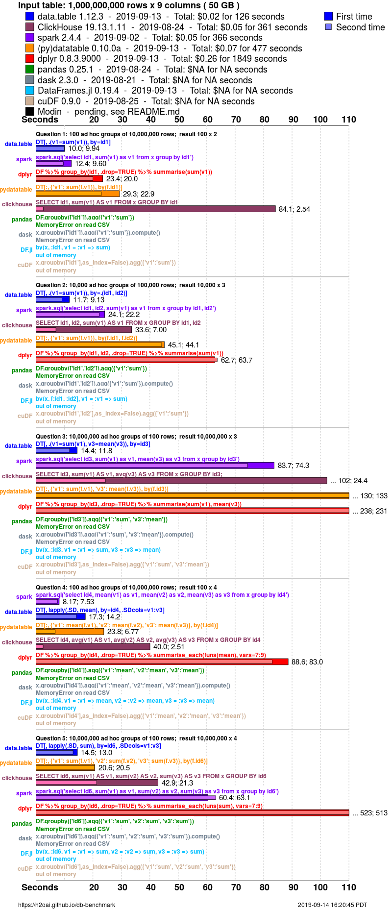

```{r setup, include=FALSE}
knitr::opts_chunk$set(echo = TRUE)
```


`R` est réputé être un langage lent et de nombreux exemples sur internet proposent des comparatifs de vitesse qui suggèrent que `python` est plus rapide (nous avons déjà proposé un petit comparatif dans l'introduction de ce cours). Il est vrai que le langage de base `R` est lent mais, pour être honnête, avec le développement de `data.table` et `tidyverse`, la grammaire de base est de moins en moins utilisée de manière exclusive. Pour rendre réellement compte des performances du langage `R`, il convient donc de mesurer les vitesses d'exécution de ces deux approches. A ce jeu, `data.table` est très performant:


<!--------
<div class="superbigimage">
```{r, echo = FALSE, fig.height=30}

```
</div>
-------->

Dans ce chapitre, nous allons exlorer la manière dont `data.table` permet de résoudre efficacement de nombreuses tâches de maniement de données. Nous comparerons la vitesse et les besoins en mémoire par rapport à une approche `tidyverse`. Pour approfondir certains aspects du package (notamment l'indexation secondaire que nous laisserons de côté), plusieurs vignettes sont disponibles sur la [page de documentation](https://github.com/Rdatatable/data.table/wiki/Getting-started) du package^[Ce cours couvre de manière transversale les vignettes du package: *"Introduction to data.table"* ; *"Keys and fast binary search based subset"* ; *"Reference semantics"* : *"Efficient reshaping using data.tables"*. Les autres vignettes *"Benchmarking data.table"* et *"Secondary indices and auto indexing"* sont intéressantes également. 

**Sur la grammaire** La syntaxe `data.table` a mauvaise presse auprès des utilisateurs de `dplyr` (ce [post](https://stackoverflow.com/questions/21435339/data-table-vs-dplyr-can-one-do-something-well-the-other-cant-or-does-poorly) `stack overflow` est un bon exemple de la guerre larvée entre les utilisateurs des deux approches.^[On peut d'ailleurs y retrouver une réponse extensive d'Hadley Wickham (créateur dplyr) et des créateurs de `data.table` comparant et justifiant les deux approches.]). Il y a un coût d'apprentissage à la syntaxe `data.table` lorsqu'on est un habitué à la grammaire du `tidyverse`. Cependant, comme ces deux approches reposent sur la philosophie du `split`-`apply`-`combine`, passé la forme différente, ce qu'on sait faire avec l'un peut facilement être traduit avec l'autre. Je recommande vivement la consultation de ce [post](https://atrebas.github.io/post/2019-03-03-datatable-dplyr/) qui compare de manière extensive les deux grammaires. Les 5 verbes fondamentaux du `tidyverse` (`filter`, `select`, `mutate`, `arrange` et `summarise`) ont une traduction en `data.table`. Comme Hadley Wickham (créateur de `dplyr`) l'évoque, il est vrai que sans connaissance de `data.table`, les verbes équivalents sont moins intelligibles que ceux du `tidyverse`. En revanche, une fois habitué, cette syntaxe est très puissante et permet de réaliser des opérations très complexes de manière assez aisée (peut-être plus qu'en utilisant les *nested* dataframes du tidyverse)^[A titre personnel, maintenant que j'y suis habitué, j'ai une préférence pour la syntaxe `data.table` après avoir été un grand utilisateur/amateur du `tidyverse`.].


**Pourquoi faire du `data.table` quand on sait faire du `tidyverse`?**  La citation ci-dessous, issue du [post](https://stackoverflow.com/questions/21435339/data-table-vs-dplyr-can-one-do-something-well-the-other-cant-or-does-poorly) déjà évoqué, souligne bien que l'objectif de ce cours, qui est de traiter efficacement de grosses bases de données en `R`, ne correspond pas à un cas d'usage autour duquel le `tidyverse` est construit: 

> Memory and performance [...] to me, they're not that important. Most R users work with well under 1 million rows of data, and dplyr is sufficiently fast enough for that size of data that you're not aware of processing time. We optimise dplyr for expressiveness on medium data; feel free to use data.table for raw speed on bigger data.
> Hadley Wickham ([lien](https://stackoverflow.com/questions/21435339/data-table-vs-dplyr-can-one-do-something-well-the-other-cant-or-does-poorly/27840349#27840349))

# Principe

`data.table` est un package qui propose une version améliorée des objets de base que sont les `data.frames`. Cependant, contrairement aux dataframes, on peut faire beaucoup plus que sélectionner des lignes ou des colonnes dans les crochets `df[...]`. En fait, on peut penser les instructions à l'intérieur du crochet comme des requêtes SQL mises en forme différemment. L'une des forces du package, sur lequel nous reviendrons, est que de nombreuses fonctionnalités de celui-ci reposent sur la modification par référence: pour créer une colonne `y = x+1` on n'a pas besoin de perdre du temps et mobiliser de la mémoire pour effectuer une copie temporaire du dataframe. 

La syntaxe `data.table` prend la forme générale

```{r, eval = FALSE}
DT[i, j, by]
```

R              |                 i         |              j         |      by
---------------|---------------------------|------------------------|-----------
SQL (exemples) |  `where` ou `order by`    |  `select` ou  `update` | `group by`

On peut convertir un objet en data.table en utilisant `data.table::setDT` ou `data.table::as.data.table`. Pour créer un data.table, on utilisera la fonction `data.table::data.table` comme on utiliserait la fonction `data.frame` pour créer un dataframe. Comme avec un `tibble`, la visualisation est améliorée par rapport à un `data.frame` standard:

```{r}
dt <- data.table::data.table(x = runif(1e4), y = runif(1e3))
dt
```

Les numéros de lignes sont écrits avec un `:`. Contrairement à un data.frame, les colonnes de type `character` ne sont jamais converties en `factor` par défaut. Un data.table n'utilise pas de `rownames`: il y a un outil beaucoup plus puissant, les clés sur lesquelles nous reviendrons.


Les `data.table` héritant de caractéristiques des `data.frame`, on peut normalement leur appliquer toutes les méthodes qui s'appliquent aux `data.frames` de base. En particulier, on peut appliquer les fonctions de maniement des données du `tidyverse` aux `data.tables`: on peut utiliser `stringr` pour le maniement de caractères, `lubridate` pour des colonnes temporelles, etc. Avant d'appliquer une fonction du `tidyverse` à un `data.table`, il peut être utile de vérifier qu'il n'existe pas un équivalent déjà proposé par le package `data.table`. Par exemple, plutôt que d'utiliser la fonction `stringr::str_split_fixed` pour séparer une colonne en fonction d'un caractère, on utilisera `data.table::tstrsplit`:

```{r}
dt <- data.table::data.table(x = paste0("x_",runif(1e4)))
df <- dplyr::as_tibble(dt)

m <- microbenchmark::microbenchmark(
  dt[,data.table::tstrsplit(dt$x, "_", fixed = TRUE)],
  stringr::str_split_fixed(df$x,"_", n = 2)
)
ggplot2::autoplot(m)
m
```

Sur ce problème simple, la solution `data.table` est 2 fois plus rapide. 
On proposera, tout au long de ce chapitre, des alternatives `data.table` aux 5 verbes fondamentaux de la grammaire `tidyverse` (`filter`, `select`, `mutate`, `arrange` et `summarise`)

L'utilisation de `dplyr` en production peut poser problème. En effet, il ne s'agit pas d'un langage de programmation fonctionnelle mais d'une syntaxe visant à faciliter le maniement de données. `dplyr` étant un package jeune, il n'est pas aussi stable que `data.table`: certaines fonctionnalités peuvent rapidement ne plus être maintenues au profit d'autres.

## Aparté: sur l'évaluation standard 

Il existe deux manières de faire référence à un objet en `R`:

* L'évaluation standard:
* L'évaluation non-standard: les noms font référence

<!----
les noms font référence aux valeurs. Si on tape `x`, c'est qu'on fait référence à l'objet dans l'environnement global qui s'appelle `x`
---->

Par exemple,

Approche   | Evaluation standard (SE) | Evaluation non standard (NSE)  |
-----------|--------------------------|--------------------------------|
`dplyr`    |  `df %>% dplyr::filter(x < 10)` | `df %>% dplyr::filter(!!rlang::sym("x")<10)`
`dplyr`    |  `df[x<10]`              | `df[get('x')<10]`

En évaluation non standard, l'objet `x` est compris comme faisant parti de l'environnement en question (par exemple le dataframe `df` ou le data.table `dt`). Ce n'est que s'il n'existe pas dans cet environnement que `R` cherchera dans l'environnement global

`data.table` et `dplyr` reposent tous deux sur l'ingration standard (on cite les noms de colonnes sous la forme `dt[,x]` ou `df %>% mutate(x)` ce qui relève de l'intégration standard). L'intégration de l'évaluation standard, qui est à la fois pratique dans une approche de programmation fonctionnelle (on peut passer des noms de variable en argument d'une fonction) et désirable pour la reproductibilité des programmes est ardue à mettre en oeuvre dans `dplyr` alors qu'elle est très simple en `data.table`^[Si vous ne me croyez pas, essayer de comprendre du premier coup la [vignette dplyr](https://dplyr.tidyverse.org/articles/programming.html) sur le sujet]. 

# Import de données

Pour montrer l'intérêt des fonctions d'import de `data.table` nous allons utiliser la base de données `sirus` 2017 (extrait de Sirene) qui avait servi au [hackathon](https://github.com/SSP-Lab/Hackathon-2018) de l'INSEE en 2018. Le fichier fait 2GB sur disque et environ 3.5 GB en RAM une fois importé entièrement dans `R`. 


## Comparaison des fonctions accessibles

Dans ce premier comparatif, on va comparer les vitesses d'exécution des fonctions:

* `data.table::fread`
* `readr::read_csv`
* `read.csv` du langage de base

On utilise le fichier `sirus_abstract.csv` qui est un extrait de sirus sur un million d'observations. 

```{r, eval = FALSE}
# Code ayant généré sirus_abstract.csv
df <- data.table::fread("./data/sirus_2017.csv")
data.table::fwrite(
  df[sample(.N, size = 1e6, replace = FALSE)],
  file = "./data/sirus_abstract.csv"
)
```

La fonction de lecture du package `data.table` est `fread` pour *fast read*. Elle permet de lire des fichiers texte, qu'ils soient zippés ou non. Pour accélérer la routine, la fonction repose sur le principe du multithreading (cf. chapitre précédent) dans `C`. 

**Exercice**

Faire un profiling, avec la fonction `profvis::profvis` des méthodes suivantes (n'hésitez pas à consulter l'aide de chaque fonction pour obtenir le nom des arguments)

1. `read.csv` en faisant attention à ne pas oublier l'option `stringsAsFactors = FALSE` et l'argument `sep`
2. `readr::read_csv` en désactivant la barre de progrès
3. `data.table::fread` en désactivant également la barre de progrès

Je recommande d'appeler la commande `gc()` entre chaque commande pour mesurer de manière plus précise les besoins en mémoire spécifiques à chaque méthode. 

```{r}

profvis::profvis({
  
  df_1 <- read.csv("./data/sirus_abstract.csv",
                   sep = ",",
                   stringsAsFactors = FALSE) 
  gc()  # gc pour ne pas biaiser la mesure des besoins mémoires
  df_2 <- readr::read_csv("./data/sirus_abstract.csv",
                          progress = FALSE) 
  gc()  # gc pour ne pas biaiser la mesure des besoins mémoires
  df_3 <- data.table::fread("./data/sirus_abstract.csv",
                            showProgress = FALSE)
  
})
```

La fonction `data.table` est à la fois

* plus rapide: 3 secondes contre 6 pour readr et 18 pour la fonction de base
* moins gourmande en RAM: pour importer un jeu de données faisant environ 400MBe en RAM, il est nécessaire d'utiliser 900 MB pour readr et 1.3GB pour la fonction de base. `data.table` est lui très parcimonieux puisqu'il ne nécessite pas plus que les 400MB nécessaires.

La fonction de base est très lente. Pourtant, elle est codée en `C` comme la fonction de `data.table`. Le principal problème avec la fonction de base, que les fonctions `readr` et `fread` évitent est d'importer l'ensemble du fichier sous forme `character` et convertir a posteriori les colonnes pouvant l'être sous des formats numériques. Les fonctions `read_csv` et `fread` inspectent le fichier avant de l'importer (les premières lignes pour `read_csv` ; les premières et dernières lignes pour `fread`)

On peut utiliser l'option `verbose = TRUE` pour avoir une meilleure idée de la manière dont `fread` fonctionne

```{r}
df_3 <- data.table::fread("./data/sirus_abstract.csv",
                            verbose = TRUE)
```


# Sémantique

DF$c <- 18:13               # (1) -- replace entire column
# or
DF$c[DF$ID == "b"] <- 15:13 # (2) -- subassign in column 'c'

deep copy of the entire data.frame in versions of R versions < 3.1. It copied more than once. To improve performance by avoiding these redundant copies, data.table utilised the available but unused := operator in R.

Great performance improvements were made in R v3.1 as a result of which only a shallow copy is made for (1) and not deep copy. However, for (2) still, the entire column is deep copied even in R v3.1+. This means the more columns one subassigns to in the same query, the more deep copies R does.

## shallow vs deep copy

A shallow copy is just a copy of the vector of column pointers (corresponding to the columns in a data.frame or data.table). The actual data is not physically copied in memory.

A deep copy on the other hand copies the entire data to another location in memory.

With data.table's := operator, absolutely no copies are made in both (1) and (2), irrespective of R version you are using. This is because := operator updates data.table columns in-place (by reference).

DT[, c("colA", "colB", ...) := list(valA, valB, ...)]
DT[, `:=`(colA = valA, # valA is assigned to colA
          colB = valB, # valB is assigned to colB
          ...
)]


The result is returned invisibly.

Update some rows of columns by reference - sub-assign by reference flights[hour == 24L, hour := 0L]

c) Delete column by reference

Assigning NULL to a column deletes that column. And it happens instantly.

e) Multiple columns and :=

in_cols  = c("dep_delay", "arr_delay")
out_cols = c("max_dep_delay", "max_arr_delay")
flights[, c(out_cols) := lapply(.SD, max), by = month, .SDcols = in_cols]

Note that since we allow assignment by reference without quoting column names when there is only one column as explained in Section 2c, we can not do out_cols := lapply(.SD, max). That would result in adding one new column named out_col. Instead we should do either c(out_cols) or simply (out_cols). Wrapping the variable name with ( is enough to differentiate between the two cases.

## := and copy()

ometimes, we would like to pass a data.table object to a function, and might want to use the := operator, but wouldn't want to update the original object. We can accomplish this using the function copy().

The copy() function deep copies the input object and therefore any subsequent update by reference operations performed on the copied object will not affect the original object.

# Subsetting

## subsetting des lignes

Within the frame of a data.table, columns can be referred to as if they are variables, much like in SQL or Stata. Therefore, we simply refer to dest and month as if they are variables. A comma after the condition in i is not required. But flights[dest == "JFK" & month == 6L, ] would work just fine. In data.frames, however, the comma is necessary.

.N 
.N is a special built-in variable that holds the number of observations in the current group. 

.I
.SD

sorting: We can use the R function order() to accomplish this.

Pour prendre un sample: dt[sample(.N, 1e3, replace = FALSE)]

## := et passage par référence


## Subsetting des colonnes


1 seule colonne: flights[, arr_delay] NSE ou flights[, get('arr_delay')] SE  flights[["arr_delay"]]
Select arr_delay column, but return as a data.table instead. 
ans <- flights[, list(arr_delay)]
We wrap the variables (column names) within list(), which ensures that a data.table is returned. In case of a single column name, not wrapping with list() returns a vector instead,
data.table also allows wrapping columns with .() instead of list(). It is an alias to list(); they both mean the same. 

Select both arr_delay and dep_delay columns.
ans <- flights[, .(arr_delay, dep_delay)]
head(ans)
elect both arr_delay and dep_delay columns and rename them to delay_arr and delay_dep.

Since .() is just an alias for list(), we can name columns as we would while creating a list.

ans <- flights[, .(delay_arr = arr_delay, delay_dep = dep_delay)]
head(ans)

Equivalent du select avec .SDcols

select_cols = c("arr_delay", "dep_delay")
flights[ , ..select_cols]
flights[ , select_cols, with = FALSE]
For those familiar with the Unix terminal, the .. prefix should be reminiscent of the “up-one-level” command, which is analogous to what’s happening here – the .. signals to data.table to look for the select_cols variable “up-one-level”, i.e., in the global environment in this case.
with = TRUE is the default in data.table because we can do much more by allowing j to handle expressions

# Aggregations


ans <- flights[, sum( (arr_delay + dep_delay) < 0 )]
ans


ans <- flights[, .(.N), by = .(origin)]


ans <- flights[carrier == "AA",
        .(mean(arr_delay), mean(dep_delay)),
        keyby = .(origin, dest, month)]
ans
All we did was to change by to keyby. This automatically orders the result by the grouping variables in increasing order. In fact, due to the internal implementation of by first requiring a sort before recovering the original table’s order, keyby is typically faster than by because it doesn’t require this second step.
Keys: Actually keyby does a little more than just ordering. It also sets a key after ordering by setting an attribute called sorted.


 Can by accept expressions as well or does it just take columns?

Yes it does. As an example, if we would like to find out how many flights started late but arrived early (or on time), started and arrived late etc…

ans <- flights[, .N, .(dep_delay>0, arr_delay>0)]
ans


Special symbol .SD:

data.table provides a special symbol, called .SD. It stands for Subset of Data. It by itself is a data.table that holds the data for the current group defined using by.

Recall that a data.table is internally a list as well with all its columns of equal length.

Let’s use the data.table DT from before to get a glimpse of what .SD looks like.

.SD contains all the columns except the grouping columns by default.

To compute on (multiple) columns, we can then simply use the base R function lapply().

DT[, lapply(.SD, mean), by = ID]

.SD holds the rows corresponding to columns a, b and c for that group. We compute the mean() on each of these columns using the already-familiar base function lapply().

Each group returns a list of three elements containing the mean value which will become the columns of the resulting data.table.

Since lapply() returns a list, so there is no need to wrap it with an additional .() 

.SDcols

Using the argument .SDcols. It accepts either column names or column indices. 

How can we return the first two rows for each month?

ans <- flights[, head(.SD, 2), by = month]
head(ans)


Parler de l'indexation


# Utilisation avancée


# Fast subsetting
All data.frames have a row names attribute. We can subset a particular row using its row name. 

row names are more or less an index to rows of a data.frame. However,

Each row is limited to exactly one row name.
row names should be unique.
data.tables never uses row names. Since data.tables inherit from data.frames, it still has the row names attribute. But it never uses them.
Instead, in data.tables we set and use keys

We can set keys on multiple columns and the column can be of different types 
Uniqueness is not enforced, i.e., duplicate key values are allowed. Since rows are sorted by key, any duplicates in the key columns will appear consecutively.

Setting a key does two things:

    physically reorders the rows of the data.table by the column(s) provided by reference, always in increasing order.

    marks those columns as key columns by setting an attribute called sorted to the data.table.
    
    Note that we did not have to assign the result back to a variable. This is because like the := function we saw in the “Introduction to data.table” vignette, setkey() and setkeyv() modify the input data.table by reference. They return the result invisibly.
    
    
set* and :=

In data.table, the := operator and all the set* (e.g., setkey, setorder, setnames etc..) functions are the only ones which modify the input object by reference.

Once you key a data.table by certain columns, you can subset by querying those key columns using the .() notation in i.

flights[.("JFK")]
The key column has already been set to origin. So it is sufficient to provide the value, here “JFK”, directly. The .() syntax helps identify that the task requires looking up the value “JFK” in the key column of data.table (here column origin of flights data.table).


Subset all rows using key columns where first key column origin matches “JFK” and second key column dest matches “MIA”

setkey(flights, origin, dest)
flights[.("JFK", "MIA")]


flights[.("LGA", "TPA"), .(arr_delay)]


We have seen so far how we can set and use keys to subset. But what’s the advantage? For example, instead of doing:

# key by origin,dest columns
flights[.("JFK", "MIA")]

we could have done:

flights[origin == "JFK" & dest == "MIA"]

One advantage very likely is shorter syntax. But even more than that, binary search based subsets are incredibly fast.

To use slow vector scan key needs to be removed.

setkey(flights, NULL)
flights[origin == "JFK" & dest == "MIA"]


The speed-up of indexes data.table is ~327x!


Vector scan approach:

    The column x is searched for the value “g” row by row, on all 20 million of them. This results in a logical vector of size 20 million, with values TRUE, FALSE or NA corresponding to x’s value.

    Similarly, the column y is searched for 877 on all 20 million rows one by one, and stored in another logical vector.

    Element wise & operations are performed on the intermediate logical vectors and all the rows where the expression evaluates to TRUE are returned.

This is what we call a vector scan approach. And this is quite inefficient, especially on larger tables and when one needs repeated subsetting, because it has to scan through all the rows each time.

Now let us look at binary search approach (method 2). Recall from Properties of key - setting keys reorders the data.table by key columns. Since the data is sorted, we don’t have to scan through the entire length of the column! We can instead use binary search to search a value in O(log n) as opposed to O(n) in case of vector scan approach, where n is the number of rows in the data.table.

Since rows of each column of data.tables have contiguous locations in memory, the operations are performed in a very cache efficient manner (also contributes to speed).


## Remplacement conditionnel très efficace


A mettre dans `data.table`:

beaucoup mieux d'updater les lignes par référence, de cette manière


```{r, eval = FALSE}
df1 <- data.table::copy(df)
df2 <- data.table::copy(df)
df3 <- data.table::copy(df)
ggplot2::autoplot(microbenchmark::microbenchmark(
     df1[!is.finite(get('wealth2009')), 'wealth2009' := 0][],
     df2[,'wealth2009' := lest::if_else(!is.finite(get('wealth2009')),0,get('wealth2009'))][],
     df3[,'wealth2009' := hutils::if_else(!is.finite(get('wealth2009')),0,get('wealth2009'))][],
     times = 20
 ))
```
