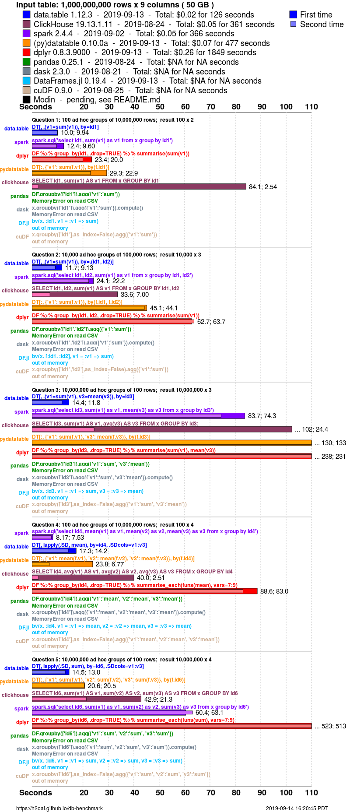
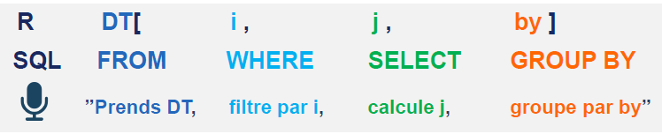

# `data.table`: un package efficace en `R`

<script src="./js/hideOutput.js"></script>

```{r setup, include=FALSE}
knitr::opts_chunk$set(echo = TRUE)
knitr::opts_knit$set(root.dir = "~")
```


`R` est réputé être un langage lent et de nombreux exemples sur internet proposent des comparatifs de vitesse qui suggèrent que `python` est plus rapide (nous avons déjà proposé un petit comparatif dans l'introduction de ce cours). Il est vrai que le langage de base `R` est lent mais, pour être honnête, avec le développement de `data.table` et `tidyverse`, la grammaire de base est de moins en moins utilisée de manière exclusive. Pour rendre réellement compte des performances du langage `R`, il convient donc de mesurer les vitesses d'exécution de ces deux approches. A ce jeu, `data.table` est très performant:


<!--------
<div class="superbigimage">
```{r, echo = FALSE, fig.height=30}

```
</div>
-------->

Dans ce chapitre, nous allons exlorer la manière dont `data.table` permet de résoudre efficacement de nombreuses tâches de maniement de données. Nous comparerons la vitesse et les besoins en mémoire par rapport à une approche `tidyverse`. Pour approfondir certains aspects du package (notamment l'indexation secondaire que nous laisserons de côté), plusieurs vignettes sont disponibles sur la [page de documentation](https://github.com/Rdatatable/data.table/wiki/Getting-started) du package^[Ce cours couvre de manière transversale les vignettes du package: *"Introduction to data.table"* ; *"Keys and fast binary search based subset"* ; *"Reference semantics"* : *"Efficient reshaping using data.tables"*. Les autres vignettes *"Benchmarking data.table"* et *"Secondary indices and auto indexing"* sont intéressantes également] et un résumé des commandes standards est disponible [ici](https://github.com/Rdatatable/data.table/wiki).  


**Sur la grammaire** La syntaxe `data.table` a mauvaise presse auprès des utilisateurs de `dplyr` (ce [post](https://stackoverflow.com/questions/21435339/data-table-vs-dplyr-can-one-do-something-well-the-other-cant-or-does-poorly) `stack overflow` est un bon exemple de la guerre larvée entre les utilisateurs des deux approches.^[On peut d'ailleurs y retrouver une réponse extensive d'Hadley Wickham (créateur dplyr) et des créateurs de `data.table` comparant et justifiant les deux approches.]). Il y a un coût d'apprentissage à la syntaxe `data.table` lorsqu'on est un habitué à la grammaire du `tidyverse`. Cependant, comme ces deux approches reposent sur la philosophie du `split`-`apply`-`combine`, passé la forme différente, ce qu'on sait faire avec l'un peut facilement être traduit avec l'autre. Je recommande vivement la consultation de ce [post](https://atrebas.github.io/post/2019-03-03-datatable-dplyr/) qui compare de manière extensive les deux grammaires. Les 5 verbes fondamentaux du `tidyverse` (`filter`, `select`, `mutate`, `arrange` et `summarise`) ont une traduction en `data.table`. Comme Hadley Wickham (créateur de `dplyr`) l'évoque, il est vrai que sans connaissance de `data.table`, les verbes équivalents sont moins intelligibles que ceux du `tidyverse`. En revanche, une fois habitué, cette syntaxe est très puissante et permet de réaliser des opérations très complexes de manière assez aisée (peut-être plus qu'en utilisant les *nested* dataframes du tidyverse)^[A titre personnel, maintenant que j'y suis habitué, j'ai une préférence pour la syntaxe `data.table` après avoir été un grand utilisateur/amateur du `tidyverse`.].


**Pourquoi faire du `data.table` quand on sait faire du `tidyverse`?**  La citation ci-dessous, issue du [post](https://stackoverflow.com/questions/21435339/data-table-vs-dplyr-can-one-do-something-well-the-other-cant-or-does-poorly) déjà évoqué, souligne bien que l'objectif de ce cours, qui est de traiter efficacement de grosses bases de données en `R`, ne correspond pas à un cas d'usage autour duquel le `tidyverse` est construit: 

> Memory and performance [...] to me, they're not that important. Most R users work with well under 1 million rows of data, and dplyr is sufficiently fast enough for that size of data that you're not aware of processing time. We optimise dplyr for expressiveness on medium data; feel free to use data.table for raw speed on bigger data.
> Hadley Wickham ([lien](https://stackoverflow.com/questions/21435339/data-table-vs-dplyr-can-one-do-something-well-the-other-cant-or-does-poorly/27840349#27840349))

`data.table` est plus rapide mais est aussi moins gourmand en `RAM`. Il s'agit donc d'une solution intéressante pour des bases de données de grosses tailles (comme les données administratives) mais qui rentrent encore en mémoire. Nous verrons dans le dernier chapitre des solutions *out-of-memory* pour les bases qui ne peuvent être lues en `R` parce que trop volumineuses (ou pour lesquelles des traitements statistiques, par exemple une régression linéaire, amènerait à saturer la RAM)

**data.table en production** `data.table` ne dépend que de `R` base et n'importe de fonctions que du package `methods` (présent dans la distribution de base de `R`). Cela signifie que le package est extrêmement robuste puisque la distribution `R` base est très stable. Le `tidyverse` étant un écosystème très récent, il est beaucoup moins stable que `data.table`. Pour des projets en production, on peut donc se fier à `data.table` ; à condition de faire attention aux effets induits du comportement de passage par référence sur lequel on reviendra.  

L'utilisation de `dplyr` en production peut poser problème. En effet, il ne s'agit pas d'un langage de programmation fonctionnelle mais d'une syntaxe visant à faciliter le maniement de données. `dplyr` étant un package jeune, il n'est pas aussi stable que `data.table`: certaines fonctionnalités peuvent rapidement ne plus être maintenues au profit d'autres.


## Principe

`data.table` est un package qui propose une version améliorée des objets de base que sont les `data.frames`. Cependant, contrairement aux dataframes, on peut faire beaucoup plus que sélectionner des lignes ou des colonnes dans les crochets `df[...]`. En fait, on peut penser les instructions à l'intérieur du crochet comme des requêtes SQL mises en forme différemment. L'une des forces du package, sur lequel nous reviendrons, est que de nombreuses fonctionnalités de celui-ci reposent sur la modification par référence: pour créer une colonne `y = x+1` on n'a pas besoin de perdre du temps et mobiliser de la mémoire pour effectuer une copie temporaire du dataframe. 

La syntaxe `data.table` prend la forme générale



On peut convertir un objet en data.table en utilisant `data.table::setDT` ou `data.table::as.data.table`. Pour créer un data.table, on utilisera la fonction `data.table::data.table` comme on utiliserait la fonction `data.frame` pour créer un dataframe. Comme avec un `tibble`, la visualisation est améliorée par rapport à un `data.frame` standard:

```{r}
dt <- data.table::data.table(x = runif(1e4), y = runif(1e3))
dt
```

Les numéros de lignes sont écrits avec un `:`. Contrairement à un data.frame, les colonnes de type `character` ne sont jamais converties en `factor` par défaut. Un data.table n'utilise pas de `rownames`: il y a un outil beaucoup plus puissant, les clés sur lesquelles nous reviendrons. Par défaut, les classes des colonnes ne sont pas affichées. Si vous désirez les afficher, comme cela est fait sur les  `tibble`, vous pouvez changer l'option associée de la manière suivante:

```{r}
options(datatable.print.class = TRUE)
data.table::as.data.table(iris)
options(datatable.print.class = FALSE)
```


Les `data.table` héritant de caractéristiques des `data.frame`, on peut normalement leur appliquer toutes les méthodes qui s'appliquent aux `data.frames` de base. En particulier, on peut appliquer les fonctions de maniement des données du `tidyverse` aux `data.tables`: on peut utiliser `stringr` pour le maniement de caractères, `lubridate` pour des colonnes temporelles, etc. Avant d'appliquer une fonction du `tidyverse` à un `data.table`, il peut être utile de vérifier qu'il n'existe pas un équivalent déjà proposé par le package `data.table`. Par exemple, plutôt que d'utiliser la fonction `stringr::str_split_fixed` pour séparer une colonne en fonction d'un caractère, on utilisera `data.table::tstrsplit`:

```{r benchmark strsplit}
dt <- data.table::data.table(x = paste0("x_",runif(1e4)))
df <- dplyr::as_tibble(dt)

m <- microbenchmark::microbenchmark(
  dt[,data.table::tstrsplit(dt$x, "_", fixed = TRUE)],
  stringr::str_split_fixed(df$x,"_", n = 2)
)
ggplot2::autoplot(m)
m
```

Sur ce problème simple, la solution `data.table` est 2 fois plus rapide. On proposera, tout au long de ce chapitre, des alternatives `data.table` aux 5 verbes fondamentaux de la grammaire `tidyverse` (`filter`, `select`, `mutate`, `arrange` et `summarise`). Il existe un package `dtplyr` qui propose des fonctions identiques à celles de `dplyr` (`filter`, `mutate`...) sur des objets `data.table`. Comme il s'agit d'une surcouche (qui traduit une fonction `dplyr` en l'équivalent `data.table` implicitement) il y a une perte (limitée) de performance inhérente à l'utilisation de ce package. Ce package a pour principalement inconvénient de ne pas proposer la copie par référence permise par l'opérateur `:=` (sur lequel nous reviendrons) dans le verbe équivalent `mutate` ; une des forces du package `data.table` disparaît. 


### Aparté: sur l'évaluation standard 


Il existe deux manières de faire référence à un objet en `R`:

* L'évaluation standard:
* L'évaluation non-standard: les noms font référence

<!----
les noms font référence aux valeurs. Si on tape `x`, c'est qu'on fait référence à l'objet dans l'environnement global qui s'appelle `x`
---->

Par exemple,

Approche   | Evaluation standard (SE) | Evaluation non standard (NSE)  |
-----------|--------------------------|--------------------------------|
`dplyr`    |  `df %>% dplyr::filter(x < 10)` | `df %>% dplyr::filter(!!rlang::sym("x")<10)`
`dplyr`    |  `df[x<10]`              | `df[get('x')<10]`

En évaluation non standard, l'objet `x` est compris comme faisant partie de l'environnement en question (par exemple le dataframe `df` ou le data.table `dt`). Ce n'est que s'il n'existe pas dans cet environnement que `R` cherchera dans l'environnement global

`data.table` et `dplyr` reposent tous deux sur l'ingration standard (on cite les noms de colonnes sous la forme `dt[,x]` ou `df %>% mutate(x)` ce qui relève de l'intégration standard). L'intégration de l'évaluation standard, qui est à la fois pratique dans une approche de programmation fonctionnelle (on peut passer des noms de variable en argument d'une fonction) et désirable pour la reproductibilité des programmes est ardue à mettre en oeuvre dans `dplyr` alors qu'elle est très simple en `data.table`^[Si vous ne me croyez pas, essayer de comprendre du premier coup la [vignette dplyr](https://dplyr.tidyverse.org/articles/programming.html) sur le sujet]. 

Il est possible d'appliquer de l'évaluation non standard de deux autres manières en `data.table`. Elles sont présentées ici mais ne seront pas approfondies^[Les personnes familières avec la syntaxe `unix` retrouveront une similarité entre les `..` en `data.table` et sur le terminal. C'est le même principe qui s'applique: `..` signifie "un niveau au-dessus": `..` signale à `data.table` de rechercher les variables `select_cols` un niveau au-dessus, i.e. dans l'environnement global dans ce cas.]:

```{r, eval = FALSE}
select_cols = c("x", "y")
flights[ , ..select_cols]
flights[ , select_cols, with = FALSE]
```

Le lecteur intéressé pourra se reporter aux vignettes `data.table` sur le sujet. 

## Lecture et écriture de données

Pour montrer l'intérêt des fonctions d'import de `data.table` nous allons utiliser la base de données `sirus` 2017 (extrait de `Sirene`) qui avait servi au [hackathon](https://github.com/SSP-Lab/Hackathon-2018) de l'INSEE en 2018. Le fichier fait 2GB sur disque et environ 3.5 GB en RAM une fois importé entièrement dans `R`. 


### Comparaison des fonctions de lecture

Dans ce premier comparatif, on va comparer les vitesses d'exécution des fonctions:

* `data.table::fread`
* `readr::read_csv`
* `read.csv` du langage de base

On utilise le fichier `sirus_abstract.csv` qui est un extrait de sirus sur un million d'observations. Mon ordinateur a 4 coeurs et 8 Go de RAM. 

```{r, eval = FALSE}
# Code ayant généré sirus_abstract.csv
df <- data.table::fread("./.~/data/sirus_2017.csv")
data.table::fwrite(
  df[sample(.N, size = 1e6, replace = FALSE)],
  file = "~/data/sirus_abstract.csv"
)
```

La fonction de lecture du package `data.table` est `fread` pour *fast read*. Elle permet de lire des fichiers texte, qu'ils soient zippés ou non. Pour accélérer la routine, la fonction repose sur le principe du multithreading (cf. chapitre précédent) dans `C`. 

**Exercice**

Faire un profiling, avec la fonction `profvis::profvis` des méthodes suivantes (n'hésitez pas à consulter l'aide de chaque fonction pour obtenir le nom des arguments)

1. `read.csv` en faisant attention à ne pas oublier l'option `stringsAsFactors = FALSE` et l'argument `sep`
2. `readr::read_csv` en désactivant la barre de progrès
3. `data.table::fread` en désactivant également la barre de progrès

Je recommande d'appeler la commande `gc()` entre chaque commande pour mesurer de manière plus précise les besoins en mémoire spécifiques à chaque méthode. 

```{r}

profvis::profvis({
  
  df_1 <- read.csv("~/data/sirus_abstract.csv",
                   sep = ",",
                   stringsAsFactors = FALSE) 
  gc()  # gc pour ne pas biaiser la mesure des besoins mémoires
  df_2 <- readr::read_csv("~/data/sirus_abstract.csv",
                          progress = FALSE) 
  gc()  # gc pour ne pas biaiser la mesure des besoins mémoires
  df_3 <- data.table::fread("~/data/sirus_abstract.csv",
                            showProgress = FALSE)
  
})
```

La fonction `data.table` est à la fois

* plus rapide: 3 secondes contre 6 pour `readr` et 18 pour la fonction de base (en console. Les résultats peuvent différer dans le rendu du `markdown`)
* moins gourmande en RAM: pour importer un jeu de données faisant environ 400MB en RAM, il est nécessaire d'utiliser 900 MB pour readr et 1.3GB pour la fonction de base. `data.table` est lui très parcimonieux puisqu'il ne nécessite pas plus que les 400MB nécessaires.

La fonction de base est très lente. Pourtant, elle est codée en `C` comme la fonction de `data.table`. Le principal problème avec la fonction de base, que les fonctions `readr` et `fread` évitent est d'importer l'ensemble du fichier sous forme `character` et convertir a posteriori les colonnes pouvant l'être sous des formats numériques. Les fonctions `read_csv` et `fread` inspectent le fichier avant de l'importer (les premières lignes pour `read_csv` ; les premières et dernières lignes pour `fread`)

On peut utiliser l'option `verbose = TRUE` pour avoir une meilleure idée de la manière dont `fread` fonctionne

```{r, eval=FALSE}
df_3 <- data.table::fread("~/data/sirus_abstract.csv",
                            verbose = TRUE)
```

### Les options de la fonction `fread`

Jusqu'à présent, on importait le fichier sans considération de l'information qui nous intéressait. Il arrive souvent que l'on ne soit intéressé que par une partie d'un fichier (certaines colonnes, un échantillon de lignes). Pour cela, on peut utiliser quelques options de la fonction `data.table::fread`:

* `nrows`: on ne garde que *N* lignes
* `select`: on ne sélectionne que les colonnes qui nous intéressent
* `drop`: on abandonne des colonnes qui ne nous intéressent pas
* `cmd`: commande shell à exécuter lors de la lecture. Il s'agit d'une option très puissante que l'on va utiliser uniquement pour sélectionner un sous-échantillon des données à partir d'une expression régulière

L'objectif est d'être moins gourmand en RAM en ne gardant que les observations (lignes ou colonnes) qui nous intéressent. 


Par exemple, on peut n'importer qu'une ligne `nrows = 1` pour connaître le nom des colonnes
```{r}
cols <- colnames(
  data.table::fread("~/data/sirus_2017.csv", nrows = 1)
)
```

On va utiliser ce vecteur `cols` par la suite donc gardez le dans l'environnement. Maintenant qu'on peut visualiser les colonnes, on peut importer les parties du fichier qui nous intéressent

**Exercice** 

1. Utiliser l'option `select` pour garder les colonnes `sirus_id`, `nic`, `ape`, `eff_3112_et`
2. Utiliser l'option `drop` et le vector `cols` pour éliminer les colonnes qui commencent par `adr_` ou `eff_`. Vous pouvez utiliser, pour filtrer `cols`: une expression régulière et `grepl` ou la fonction de base `startsWith`. Si vous êtes à l'aise avec le package `stringr` ou `stringi` il y a aussi la possibilité de les utiliser

```{r}
# Question 1 ---------------

profvis::profvis({
  df <- data.table::fread("~/data/sirus_2017.csv",
                          select = c("sirus_id", "nic", "ape", "eff_3112_et"))
})

# Question 2 ---------------

cols_to_rm <- cols[(startsWith(cols, "adr_") | startsWith(cols, "eff_"))] # Methode base
# cols_to_rm <- cols[!grepl("^(adr_|eff_)", cols)] # Methode base avec regex

profvis::profvis({
  df <- data.table::fread("~/data/sirus_2017.csv",
                          drop = cols_to_rm)
})
```

Les options précédentes permettaient de sélectionner des colonnes. Pour filtrer des lignes, on peut utiliser une commande `shell`. C'est une fonctionnalité très puissante parce qu'elle permet 

1. D'éviter de charger des données qui mobilisent de la mémoire temporairement. Comme on l'a évoqué dans le chapitre 1, `R` a une gestion globale des données caractères: faire le filtre avant de charger les données évite d'ajouter des éléments au cache pour les supprimer ensuite
2. Les commandes *shell* sont plus rapides que des surcouches `R`


**Exercice**

Je recommande de tester sur le fichier `sirus_abstract.csv` avant d'essayer sur `sirus_2017.csv`

1. On ne va garder que des observations où apparaît la ville TOULOUSE.
2. On ne va garder que les observations où n'apparaît pas la ville TOULOUSE


```{r}
# git_bash <- "C:\Users\W3CRK9\AppData\Local\Programs\Git\git-bash.exe"
# df <- data.table::fread(cmd = "findstr TOULOUSE ~/data/sirus_abstract.csv * 2>nul")

# Question 1
df <- data.table::fread(cmd = 'grep TOULOUSE ~/data/sirus_abstract.csv')

# Question 2
df <- data.table::fread('grep -v TOULOUSE ~/data/sirus_abstract.csv')
```

La commande `cmd` permet d'exécuter beaucoup plus que des commandes `grep`. Toute commande shell peut être utilisée. Le problème sur Windows provient du fait que la commande sous-jacente (`system`) fait appel à l'invite de commande DOS qui est beaucoup moins complète qu'un terminal `unix`^[On peut trouver [ici](https://happygitwithr.com/shell.html) une explication de la manière dont le terminal `git` peut se substituer, dans `Rstudio` au terminal `cmd` Windows. 
]

L'avantage de filtrer sur les lignes avec `cmd` est le gain de temps

```{r}
system.time(
df <- data.table::fread(cmd = 'grep TOULOUSE ~/data/sirus_abstract.csv')
)

system.time({
  df <- data.table::fread(file = "~/data/sirus_abstract.csv",
                          encoding = "UTF-8")
  
  df <- df[grepl(pattern = "TOULOUSE", sir_adr_et_com_lib)]
})
```

### Import d'autres formats de données

* Formats binaires `fst`: c'est un format beaucoup plus rapide à l'import que le csv. La fonction `fst::read_fst` propose une option `as.data.table` qu'on peut évaluer à `TRUE` (la valeur par défaut est `FALSE` ce qui importe sous forme de `data.frame`).
* Formats `sas`: pas de miracle, il faut utiliser la fonction `haven::read_sas` et convertir en `data.table` avec `data.table::setDT` function. La version de développement de `haven` intègre depuis Juillet 2019 des paramètres qui peuvent être précieux pour réduire les besoins mémoires et CPU lors de l'import: `col_select` et `n_max`. Ces fonctionnalités ne sont pas encore disponibles sur la version `CRAN` en revanche.


### Comparaison des écritures

1. Faire `microbenchmark`

```{r}
df <- data.frame(x = runif(10e4),
                 y = runif(10e4))
dt <- data.table::setDT(df)
dtib <- dplyr::as_tibble(df)
```

```{r}
m <- microbenchmark::microbenchmark(
  write.csv(df, file = "base.csv"),
  data.table::fwrite(dt, file = "datatable.csv"),
  readr::write_csv(dtib, path = "readr.csv"),
  times = 20
)

ggplot2::autoplot(m)

file.remove("base.csv","datatable.csv","readr.csv")
```

2. Faire profvis

```{r}
df <- data.frame(x = runif(10e6),
                 y = runif(10e6))
dt <- data.table::setDT(df)
dtib <- dplyr::as_tibble(df)

profvis::profvis({
    data.table::fwrite(dt, file = "datatable.csv")
    readr::write_csv(dt, path = "readr.csv")
})

file.remove("datatable.csv","readr.csv")
```

## La sémantique `data.table`

### Retour sur les copies

On a évoqué, lors du premier chapitre, la différence entre la copie en place et la copie en modification. On distingue parfois de :

* `deep copy` (copie profonde): la copie est indépendante de l'objet copié. Autrement dit, les modifications faites sur la copie (on parle parfois d'objet enfant, *child object*) n'affectent pas l'objet copié (l'objet parent, *parent object*). Il y a duplication dans un autre espace mémoire de l'objet initial. 
* `shallow copy` (copie superficielle): une relation de référence (typiquement via un pointeur) est créée entre l'objet copié et la copie. Les modifications faites sur les éléments communs affectent les deux objets: modifier les éléments partagés du parent ou de l'enfant modifiera l'autre objet. Il n'y a pas de duplication de l'espace physique en mémoire. 

Ce [tutoriel](https://realpython.com/copying-python-objects/) explique très bien, à partir du langage `python`, la différence entre ces deux types de comportement. 


Les `shallow copy` réduisent les besoins mémoires et sont donc plus performantes. `data.table` repose sur ce principe: on modifie les colonnes ou attributs d'un `data.table` par référence, ce qui réduit grandement les besoins mémoire de `R` (en temps normal, `R` a besoin de 2-3x plus de mémoire que la taille de l'environnement. Avec `data.table`, on peut réduire drastiquement cette marge de manoeuvre). Les `shallow copy` nécessitent en revanche de prendre plus de précautions si on désire ré-utiliser un objet parent. 


```{r}
df <- data.frame("id" = rep(c("a","b"), 10),
                 "x" = runif(20))  
tracemem(df)

y <- seq_len(20)
tracemem(y)
df$x <- y              # (1) -- replace entire column
# or
df$x[df$id == "b"] <- y[1:10] # (2) -- subassign in column 'c'
```

Jusqu'à `R 3.1` (avril 2014), les copies profondes étaient automatiques. Cela amenait à copier plus d'une fois les objets. Une amélioration significative de performance a eu lieu avec la v3.1. L'assignation (1) ne provoque plus une copie profonde mais une copie superficielle. En revanche, même depuis 3.1+, l'opération (2) provoque toujours une copie profonde de l'ensemble de la colonne. Cela signifie que plus de colonnes sont modifiées dans la même assignation plus il y a de copies et donc de besoin mémoire

### L'opérateur `:=`

L'opérateur `data.table` `:=` est construit autour du principe du passage par référence qui évite donc la copie superficielle comme profonde. On peut le comprendre comme le `mutate` de `dplyr` sauf que l'opérateur `data.table` n'effectue pas de copie superficielle contrairement à la fonction `dplyr` (ce [thread stack overflow](https://stackoverflow.com/questions/21701537/does-mutate-change-tbl-by-reference) peut être consulté sur le sujet). `:=` utilise un pointeur d'où la parcimonie en termes de mémoire

Pour créer une nouvelle colonne à un objet `data.table`, on n'a pas besoin d'utilser l'assignation `<-`, il suffit d'appeler `:=` de la manière suivante:

```{r, eval = FALSE}

# 1/ UNE SEULE COLONNE: ON CREE LA COLONNE x
DT[,'x' := values]  # EVALUATION STANDARD
DT[,x := values] # EVALUATION NON STANDARD

# 2/ PLUSIEURS COLONNES
DT[, c("colA", "colB", ...) := list(valA, valB)]
DT[, `:=`(colA = valA, # valA is assigned to colA
          colB = valB # valB is assigned to colB)
      )]
```   

Malgré l'absence de `<-`, le résultat est retourné de manière invisible. `data.table` et `dplyr` auront des performances proches lors de la création ex-nihilo d'une colonne. En revanche, `data.table` sera plus efficace lors de l'utilisation d'un objet déjà existant (au lieu de faire une copie superficielle, il utilisera directement un pointeur)


**Exercice**

Reprendre les données `sirus` complètes

1. Créer la colonne `myvar` à partir de la commande `runif` en faisant attention de ne pas se tromper sur la longueur du vecteur aléatoire (utiliser la commande `nrow` ou la commande `data.table` équivalente `.N`)

```{r}
df <- data.table::fread("~/data/sirus_2017.csv")
df[,'myvar' := runif(.N)]
df[,`:=` ('myvar1' = myvar,
          'myvar2' = 2*get('myvar'))]
```

2. Comparer les besoins mémoire et la vitesse des approches data.table et dplyr. On va créer une variable `cell_id` qui alloue chaque observation à un carreau de 1km. On va mettre en pratique une astuce pratique, par exemple utilisée par le package `btb`.  Pour cela,

    * Créer `df2 <- dplyr::as_tibble(df)`. 
    * Créer des colonnes x_cell et y_cell qui sont, respectivement, égales à 1000*round(x/1000) et 1000*round(y/1000)
    * Créer la colonne cell_id égale à `paste(x_cell,y_cell, sep='_')`

3. Créer une colonne aléatoire `w` et creer `w2` sous la forme `w - mean(w)`


```{r}
df2 <- dplyr::as_tibble(df)

import::from("magrittr","%>%")

profvis::profvis({
  
# Approche data.table
# df[,c('x_cell','y_cell') := list(
#   1000*round(x/1000), 1000*round(y/1000)
# )]
df[,`:=`(
  'x_cell' = 1000*round(x/1000), 'y_cell' = 1000*round(y/1000)
)]
df[,'cell_id' := paste(x_cell,y_cell, sep='_')]
# ou mieux en evaluation standard
# df[,'cell_id' := paste(get('x_cell'),
#                        get('y_cell'), sep='_')]

# On verra par la suite qu'on peut aussi faire
# df[,c('x_cell','y_cell') := lapply(.SD, function(x) 1000*round(x/1000)), .SDcols = c('x','y')]

df[,'cell_id' := paste(x_cell,y_cell, sep='_')]

df[,'w' := runif(.N)]
df[,'w2' := w - mean(w)]
gc()


# Approche dplyr
df2 <- df2 %>%
  dplyr::mutate('x_cell' = 1000*round(x/1000), 'y_cell' = 1000*round(y/1000))

df2 <- df2 %>%
  dplyr::mutate('cell_id' = paste(x_cell, y_cell, sep='_'))

df2 <- df2 %>% dplyr::mutate(w = runif(nrow(df2)))

df2 <- df2 %>%
  dplyr::mutate(w2 = w - mean(w))

})

```

Pour supprimer des colonnes par référence, par exemple les colonnes précédemment créées `myvar`, `myvar1` et `myvar2`, on les assignent à la valeur `NULL`

```{r}
df[, c("myvar","myvar1","myvar2") := NULL]
```


<!----------
e) Multiple columns and :=

in_cols  = c("dep_delay", "arr_delay")
out_cols = c("max_dep_delay", "max_arr_delay")
flights[, c(out_cols) := lapply(.SD, max), by = month, .SDcols = in_cols]

Note that since we allow assignment by reference without quoting column names when there is only one column as explained in Section 2c, we can not do out_cols := lapply(.SD, max). That would result in adding one new column named out_col. Instead we should do either c(out_cols) or simply (out_cols). Wrapping the variable name with ( is enough to differentiate between the two cases.
------>

Lorsqu'on désire passer un `data.table` à une fonction où sont effectués des changements par référence, on peut créer une copie de l'objet initial pour ne pas le modifier par référence (sans copie, même dans des environnements différents, l'objet parent peut être modifié). Dans ce cas, on utilise la fonction `copy` de la manière suivante `newdf <- data.table::copy(df)` et ainsi on peut modifier `newdf` sans crainte. 

### La famille des fonctions `set*`

Avec l'opérateur `:=`, les fonctions commençant par `set` permettent d'actualiser un `data.table` par référence:

* `setnames`: renommer des variables
* `setorder` et `setorderv`: trier les lignes en fonction d'une ou plusieurs colonnes
* `setcolorder`: changer l'ordre des colonnes
* `setDT` et `setDF`: transformer un df en dt ou vice-versa

|`data.table` | `dplyr`     |
|-------------|-------------|
|`setnames`   | `rename`    |
| `setorder`  | `arrange`   |
|`setcolorder`| `select(..., everything())`

**Exercice**

1. Créer une variable aléatoire `x` dans le `data.table` `df` et la renommer `u` en utilisant les arguments `old` et `new` de `data.table::setnames` (vous pouvez retrouver dans l'aide d'autres manières de modifier les noms avec `setnames`) 
2. Trier par la variable `region` et `adr_depcom`
3. Mettre les colonnes `adr_et_l6` en première position


## Requêtes sur des lignes


Dans le contexte d'un `data.table`, i.e. au sein des crochets `[]`, nous avons vu qu'on pouvait faire référence aux colonnes comme des variables. On l'a vu avec les colonnes mais c'est vrai également lorsqu'on fait une requête dans la première dimension, les lignes. Les requêtes sur la dimension `i` peuvent servir d'alternative à la fonction `dplyr::filter` (mais les requêtes sur la dimension `i` permettent de faire plus comme nous le verrons avec le remplacement conditionnel) 

```{r}
df[region == 75] # NSE
# df[get('region') == 75] # SE
```

**Exercice**

1. Comparer la vitesse et le besoin mémoire de l'approche `data.table` et de `dplyr::filter` en ne sélectionnant les lignes situées dans les départements 75, 77, 78, 91, 92, 93, 94, 95 (variable `region`) apparaîssent les termes `ECOLE`, `COLLEGE` ou `LYCEE` (et leur pluriel) dans la variable `denom` (vous pouvez utiliser une expression régulière ou `%in%`) 

```{r}
profvis::profvis({
df[(grepl("ECOLE(S?)|COLLEGE(S?)|LYCEE(S?)",denom)) & (region %in% c(75, 77, 78, 91, 92, 93, 94, 95))]
  df %>% dplyr::filter((grepl("ECOLE(S?)|COLLEGE(S?)|LYCEE(S?)",denom)) & (region %in% c(75, 77, 78, 91, 92, 93, 94, 95)))
})
```

Le package comporte quelques fonctions qui peuvent être pratiques pour effectuer des opérations de filtre:

* `%in%`: Extension du `%in%` de base
* `%chin%`: Equivalent mais pour des variables character 
* `%between%`: Comme le nom l'indique, `x %between% c(a,b)` revient à `x>=a & x<=b` 
* `%like%`: identifier les variables qui matchent un *pattern*. 

Pour obtenir simplement un échantillon des données, on peut faire la commande suivante (en supposant qu'on désire 1000 lignes)

```{r}
df[sample(.N, size = 1e4, replace = FALSE)]
```

`.N` qu'on a déjà rencontré, est une fonction construite pour retourner le nombre d'observations par groupe (les variables n'étant ici pas groupées, on renvoie le nombre de lignes).

<!---
.I
.SD
---->


### Remplacement conditionnel

Les requêtes sur la dimension `i` peuvent servir à créer de nouvelles colonnes. Dans ce cas, on peut penser la dimension `i` comme un `update` en SQL ou un `case when`

```{r}
profvis::profvis({
  
df[,'iledefrance' := FALSE]
df[region %in% c(75, 77, 78, 91, 92, 93, 94, 95), iledefrance := TRUE]

gc()

df %>% dplyr::mutate(region = dplyr::case_when(
  region %in% c(75, 77, 78, 91, 92, 93, 94, 95) ~ TRUE,
  TRUE ~ FALSE
))

})

```


### Subsetting des colonnes

Ici, c'est la dimension `j` qui est à requêter, à la manière d'un `SELECT` en `SQL`. En `dplyr`, la fonction à appliquer est `dplyr::select`. En `data.table`, on exploite la deuxième dimension au sein des crochets.

Pour selectionner une seule colonne, on choisit selon 

```{r}
# 1 / Renvoyer un data.table ----
df[,list('sirus_id' = sirus_id)] 
df[,list('sirus_id' = get("sirus_id"))] 
df[,.(sirus_id)] #.() est un alias pour list() qu'on utilisera pour l'agrégation

# Equivalent data.table de:
df2 %>% dplyr::select(sirus_id) #SE
df2 %>% dplyr::select(!!rlang::sym("sirus_id")) #NSE

# 2/ Renvoyer sous forme de vecteur la colonne ------
head(df[,sirus_id])# SE
head(df[,get('sirus_id')]) # NSE
head(df[['sirus_id']]) # NSE (ou on exploite la nature de liste d'un data.table)

# Equivalent data.table de:
df2 %>% dplyr::select(sirus_id) %>% dplyr::pull() %>%
  head()
```

La structure `df[,list("sirus_id" = sirus_id)]` permet de conserver le nom de colonne originel. Autrement, `data.table` va la renommer. La syntaxe `.()` est là pour alléger les notations: il s'agit d'un alias équivalent à `list()` qu'on utilisera fréquemment lors des agrégations. On peut généraliser cette syntaxe pour sélectionner plusieurs colonnes

**Exercice**

1. Sélectionnez les colonnes `sirus_id` et `adr_et_voie_lib` en les renommant (dans la même étape), `sirus` et `adresse`. Ceci correspond à un `SELECT sirus_id AS sirus` en `SQL`
2. Faire la même chose en `dplyr` 

```{r}
# Question 1
df[,list('sirus' = sirus_id, 'adresse' = adr_et_voie_lib)]

# Question 2
df2 %>% dplyr::select('sirus' = sirus_id, 'adresse' = adr_et_voie_lib)
```

Cette syntaxe n'est pas très pratique car elle nécessite de faire attention à bien renommer les éléments pour ne pas écraser les noms des colonnes. Il y a une syntaxe adaptée en `data.table` pour sélectionner un ensemble de colonne: il s'agit du mot clé `.SD` pour *Subset of Data*. Il s'agit d'une des fonctionnalités les plus puissantes de `data.table` dont nous allons découvrir une première application ici. `.SD` permet de faire référence à un ensemble de colonnes sous forme de liste^[En fait, l'ensemble des colonnes sélectionné par `.SD` est, en lui-même, un `data.table` stockant les données du groupe actuel défini par la condition `by` (l'ensemble des groupes si `by` n'est pas appelé)], par défaut toutes les colonnes à l'exclusion des colonnes de groupe (dimension `by` que nous explorons dans la prochaine partie). Pour spécifier les colonnes faisant référence à `.SD`, on utilise l'option `SDcols` au sein des crochets

```{r}
df[,.SD,.SDcols = c("sirus_id","adr_et_voie_lib")]
```

`.SD` peut être utilisé en conjonction avec `:=` pour créer de nouvelles colonnes par référence. Par exemple, imaginons que nous désirions retirer la valeur 1 aux colonnes `eff_3112_uniteLegale` `eff_etp_uniteLegale` (imaginons qu'on a une erreur de définition de la variable). On peut utiliser `.SD`:

```{r}
df[, c("temp_eff_3112_uniteLegale", "temp_eff_etp_uniteLegale") := .SD - 1,
   .SDcols = c("eff_3112_uniteLegale","eff_etp_uniteLegale")]
head(df)
# On supprime pour ne pas avoir trop de colonnes inutiles
df[, c("temp_eff_3112_uniteLegale", "temp_eff_etp_uniteLegale") := NULL]
```


On peut imaginer des opérations de mise à jour beaucoup plus complexes pour le `data.table`. En particulier, on peut désirer appliquer une même fonction à plusieurs colonnes: par exemple on désire arrondir plusieurs colonnes. `.SD` s'intègre très bien avec un appel à `lapply`: c'est même l'usage principal de ce mot clé. La syntaxe prend, dans ce cas, la forme suivante

```{r, eval = FALSE}
df[,lapply(.SD, myfunc, ...), .SDcols = c("var1","var2")]
```

On va régulièrement utiliser cette syntaxe.

**Exercice** Appliquez cette approche pour arrondir les colonnes `x` et `y`. Vous n'avez pas besoin d'ajouter d'arguments à la fonction `round`

```{r}
df[,lapply(.SD, round), .SDcols = c("x","y")]
```

Un usage fréquent de cette syntaxe `lapply` + `SD` est l'utilisation de fonctions d'agrégations ou de statistiques descriptives^[On peut bien-sûr utiliser des schémas de sélection de colonnes plus complexes, par exemple en fonction de leur nom ou de leur type. Les fonctions de subsetting en fonction d'expressions régulières du package `stringr` sur le vecteur de nom (`colnames(df)`) peuvent ici se montrer précieuses], notamment les fonctions `mean`,`sum`,`sd`, `quantile`, etc. 


## Agrégations

### Agrégations sans groupe

Les fonctions d'agrégation peuvent être vues comme des requêtes sur la dimension `j`. 


**Exercice**

1. Calculer la moyenne des variables eff_3112_uniteLegale et eff_etp_uniteLegale (NB: on a de multiples doubles comptes...)
2. Calculer la part des lignes pour lesquelles eff_etp_uniteLegale est inférieur à 10
3. Calculer les quantiles des distributions eff_etp_uniteLegale et eff_3112_uniteLegale: D1, Q1, médiane, Q3, D9

```{r}
# Question 1
df[,.('moy1' = mean(eff_3112_uniteLegale, na.rm = TRUE),
      'moy2' = mean(eff_etp_uniteLegale, na.rm = TRUE))]
# df[,lapply(.SD,mean,na.rm=TRUE),
#    .SDcols = c("eff_3112_uniteLegale","eff_etp_uniteLegale")]

# Question 2
df[,mean(eff_etp_uniteLegale<10L, na.rm=TRUE)]

# Question 3
df[,lapply(.SD, quantile, probs = c(.1,.25,.5,.75,.9),
           na.rm = TRUE),
   .SDcols = c("eff_etp_uniteLegale","eff_etp_uniteLegale")]

```


## Agrégations par groupe

On a, jusqu'à présent, ignoré la dimension `by`. Comme en `SQL`, il s'agit néanmoins d'une dimension qui permet d'obtenir des requêtes très complexes de manière relativement simple. Par exemple, si on désire calculer l'effectif (`eff_etp_uniteLegale`) par code postal (`adr_et_post`) d'observations par groupe, on va utiliser la syntaxe suivante:

```{r}
df[,.('effectif' = sum(eff_etp_uniteLegale, na.rm = TRUE)), by = "adr_et_post"]
```

On peut bien-sûr utiliser plusieurs variables de groupes ou effectuer les agrégations sur plusieurs colonnes.

**Exercice**
Effectuer les étapes 1 et 2 dans un profvis::profvis séparé
1. Comptez le nombre d'observations (`.N`), que vous stockerez dans une variable `n` et le nombre de valeurs uniques de la variable `apet` (avec la fonction `data.table::uniqueN`), que vous stockerez dans la variable `ndist` par département (variable `region`). Stocker le résultat dans un objet `df_agg`.
2. Quelle vitesse et besoin mémoire ? Comparer avec l'approche équivalente en tidyverse

```{r}
profvis::profvis({
# Question 1
df_agg <- df[,.('n' = .N,
                'ndist' = data.table::uniqueN(apet)), by = "region"]
})
df_agg

df_tbl <- dplyr::as_tibble(df)
profvis::profvis({
  
df_agg_tbl <- df_tbl %>%
  dplyr::group_by(region) %>%
  dplyr::summarise(
    n = n(), ndist = dplyr::n_distinct(apet)
  )
})

profvis::profvis({
# Question 1
df_agg <- df[,.('q1' = Hmisc::wtd.mean()), by = "region"]
})
df_agg

df_tbl <- dplyr::as_tibble(df)
profvis::profvis({
  
df_agg_tbl <- df_tbl %>%
  dplyr::group_by(region) %>%
  dplyr::summarise(
    n = n(), ndist = dplyr::n_distinct(apet)
  )
})

```

**L'approche `tidyverse` est ici plus rapide et moins gourmande en mémoire**. Ici, on ne tire pas pleinement profit de la vitesse du package `data.table`. On voit grâce au *profiling* qu'on perd du temps à répéter des opérations de tri. 
Plus les opérations de groupe sont complexes, plus on perd du temps dans le tri. Les données ne sont pas indexées, nous allons bientôt voir que ça va grandement accélérer la vitesse des agrégations. 

On peut, plutôt qu'utiliser le mot clé `by`, utiliser `keyby` dans certains cas. `keyby` automatiquement ordonne les résultats en fonction de la variable de groupe (`region` ici), par ordre croissant.

```{r}
df_agg <- df[,.('n' = .N,
                'ndist' = data.table::uniqueN(apet)),
             keyby = "region"]
df_agg
```

En fait, `keyby` permet, dans le même temps, d'initialiser une indexation de la table en même temps. Mais nous verrons comment effectuer celle-ci avant une opération d'agrégation: là on tirera parti des points forts de `data.table`

On peut utiliser `by` pour créer une colonne par référence. Dans ce cas, `dt[, a := b, by = c]` est la traduction `data.table` de l'opétation `df %>% dplyr::group_by(c) %>% dplyr::mutate(a = b)`. 

** Exercice **
Comparez l'approche `data.table` et `dplyr` en créant une variable `effect_moyen` qui enregistre l'effectif moyen (variable `eff_etp_uniteLegale`) par `region`. 

```{r}
profvis::profvis({
df[,effect_moyen := mean(eff_etp_uniteLegale,
                         na.rm = TRUE), by = region]
df_tbl <- df_tbl %>% dplyr::group_by(region) %>%
  dplyr::mutate(effect_moyen = mean(eff_etp_uniteLegale,
                                    na.rm = TRUE))
})
```

Sur le temps d'exécution, là encore on voit que `data.table` sans indexation est moins rapide que `dplyr`. En revanche, on retrouve l'intérêt du passage par référence pour réduire les besoins mémoires

### Agrégations sur plusieurs colonnes

On retrouve `.SD`. On va créer des variables `a`, `b` et `c` aléatoires pour avoir plus de variables sur lesquelles faire des agrégations

```{r}
df[, c('a','b','c') := lapply(1:3, function(i) runif(nrow(df)))]
df_tbl <- dplyr::as_tibble(df)
```

Pour faire des statistiques sur plusieurs colonnes par groupe, il suffit d'utiliser la fonction voulue avec `lapply` (comme on l'a vu précédemment lors de l'application de la fonction `round`)

**Exercice** 
1. Faire les moyennes des variables `a`, `b`, `c`, `eff_3112_uniteLegale`, `eff_etp_uniteLegale` en utilisant la variable `region` comme groupoe

```{r}
df[, lapply(.SD, mean, na.rm = TRUE), by = "region",
   .SDcols = c("a","b","c","eff_3112_uniteLegale","eff_etp_uniteLegale")]
```


## Indexation: accélérer les opérations par groupe et les filtres

Les dataframes de base ont un attribut qui est le `rowname` et permet de manière unique d'identifier des lignes. Cette fonctionalité n'est pas proposée par `data.table` car il existe un principe beaucoup plus puissant: les index.  


# Fast subsetting
All data.frames have a row names attribute. We can subset a particular row using its row name. 

row names are more or less an index to rows of a data.frame. However,

Each row is limited to exactly one row name.
row names should be unique.
data.tables never uses row names. Since data.tables inherit from data.frames, it still has the row names attribute. But it never uses them.
Instead, in data.tables we set and use keys

We can set keys on multiple columns and the column can be of different types 
Uniqueness is not enforced, i.e., duplicate key values are allowed. Since rows are sorted by key, any duplicates in the key columns will appear consecutively.

Setting a key does two things:

    physically reorders the rows of the data.table by the column(s) provided by reference, always in increasing order.

    marks those columns as key columns by setting an attribute called sorted to the data.table.
    
    Note that we did not have to assign the result back to a variable. This is because like the := function we saw in the “Introduction to data.table” vignette, setkey() and setkeyv() modify the input data.table by reference. They return the result invisibly.
    
    
set* and :=


Once you key a data.table by certain columns, you can subset by querying those key columns using the .() notation in i.

flights[.("JFK")]
The key column has already been set to origin. So it is sufficient to provide the value, here “JFK”, directly. The .() syntax helps identify that the task requires looking up the value “JFK” in the key column of data.table (here column origin of flights data.table).


Subset all rows using key columns where first key column origin matches “JFK” and second key column dest matches “MIA”

setkey(flights, origin, dest)
flights[.("JFK", "MIA")]


flights[.("LGA", "TPA"), .(arr_delay)]


We have seen so far how we can set and use keys to subset. But what’s the advantage? For example, instead of doing:

# key by origin,dest columns
flights[.("JFK", "MIA")]

we could have done:

flights[origin == "JFK" & dest == "MIA"]

One advantage very likely is shorter syntax. But even more than that, binary search based subsets are incredibly fast.

To use slow vector scan key needs to be removed.

setkey(flights, NULL)
flights[origin == "JFK" & dest == "MIA"]


The speed-up of indexes data.table is ~327x!


Vector scan approach:

    The column x is searched for the value “g” row by row, on all 20 million of them. This results in a logical vector of size 20 million, with values TRUE, FALSE or NA corresponding to x’s value.

    Similarly, the column y is searched for 877 on all 20 million rows one by one, and stored in another logical vector.

    Element wise & operations are performed on the intermediate logical vectors and all the rows where the expression evaluates to TRUE are returned.

This is what we call a vector scan approach. And this is quite inefficient, especially on larger tables and when one needs repeated subsetting, because it has to scan through all the rows each time.

Now let us look at binary search approach (method 2). Recall from Properties of key - setting keys reorders the data.table by key columns. Since the data is sorted, we don’t have to scan through the entire length of the column! We can instead use binary search to search a value in O(log n) as opposed to O(n) in case of vector scan approach, where n is the number of rows in the data.table.

Since rows of each column of data.tables have contiguous locations in memory, the operations are performed in a very cache efficient manner (also contributes to speed).


### Remplacement conditionnel très efficace


A mettre dans `data.table`:

beaucoup mieux d'updater les lignes par référence, de cette manière


```{r, eval = FALSE}
df1 <- data.table::copy(df)
df2 <- data.table::copy(df)
df3 <- data.table::copy(df)
ggplot2::autoplot(microbenchmark::microbenchmark(
     df1[!is.finite(get('wealth2009')), 'wealth2009' := 0][],
     df2[,'wealth2009' := lest::if_else(!is.finite(get('wealth2009')),0,get('wealth2009'))][],
     df3[,'wealth2009' := hutils::if_else(!is.finite(get('wealth2009')),0,get('wealth2009'))][],
     times = 20
 ))
```
